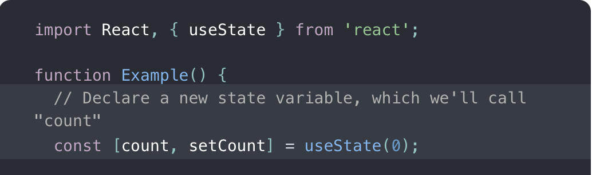
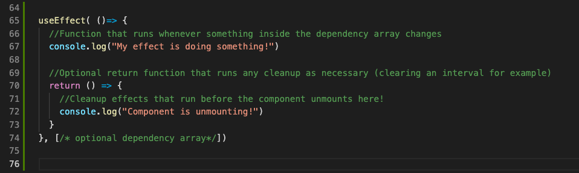

# Getting "Hooked" on React Hooks

Why Switch From Writing Class-based Components To Hooked Components?

# The Problems With Classes

From when JavaScript ES6 back in 2015 introduced Classes to the language to late 2018, React.js only supported one way of creating components with complex logic: [**classes**](https://reactjs.org/docs/react-component.html). Classes supported everything that made React websites dynamic from state logic to the component lifecycle.

There were a couple of major flaws with classes from the get-go, however.

The main problem with classes was that the component lifecycle along with necessary adjacent libraries like Redux to patch the problems with Class-based components forced an unintuitive style of thinking and led to low readability of code.

## Writing Class-Based Components: WHEN Our Component Does This, We...

**INSERT CHART FROM SESSION HERE**

## Hidden Logic behind Necessary Boilerplating

Since JavaScript is a functional programming language, creating React Components through classes also added an unnecessary level of complexity with the amount of boilerplating and restrictions that classes require.

## Hooks simplify logic and add readability to components.

When [React Hooks](https://reactjs.org/docs/hooks-faq.html) were introduced to the world during React Conference 2018, they changed the mindset of creating complex React components and became the de-facto recommended way over React Classes.

### "With hooks we separate code not based on the lifecycle method name but based on what the code is doing"

### - Dan Abramov, React Development Team Member

## Writing Hooked Components: WHAT Do We Want To Keep Track of And HOW?

**INSERT CHART FROM SESSION HERE**

# Converting From Classes To Hooks

## Binding to this --> Functional [Closures](https://developer.mozilla.org/en-US/docs/Web/JavaScript/Closures)

The existence of closures make it so that the scope of inner functions include variables/functions of its outer wrapping functions, even when called outside of its wrapper function, thus eliminating the need for this.

(There's a couple cool things we can do with closure as well we'll cover next week!)

## this.state / this.setState --> [useState](https://reactjs.org/docs/hooks-state.html)

The useState hook returns an array of 2 elements (a state variable and a function to modify the state variable), which we can use to access that instance of state. The value you put inside useState is the state's initial value, similar to the values you assign this.state for class-based components.

### NOTE:

Unlike this.setState, using your function to modify the state variable **overwrites the previous state completely.** To avoid issues, separate variables that you want to keep track of in state and avoid storing nested state variables like objects/arrays if possible. (We'll cover another hook in the future that handles nested state better than useState!)

## componentLifecycle --> [useEffect](https://reactjs.org/docs/hooks-effect.html) (and a couple more we'll cover later)

Instead of worrying about the component lifecycle, useEffect just has you worry about two things. What do you want to do, and when do you trigger the effect? The useEffect hook takes in two arguments

1. A function that you call (can be an anonymous arrow function as well)
2. An optional dependency array that signifies when you want the Effect to run.

- If you do not list a dependency array, the effect will run everytime your component updates.
- If you pass in an empty array as the dependency array, the effect will only run when the component first mounts, similarly to componentDidMount.

Instead of having a separate componentWillUnmount method, you can handle all the clean up of your useEffect by returning a callback function at the end of the function you passed in as the first argument.

### NOTE: Don't call useEffect inside of another function, it should be at the "top" level of your React Component!

# Conclusion

Hooked components reduce the boilerplating necessary for Class-based React Components, and stick true to JavaScript being a **functional** programming language as opposed to an Object-Oriented one.
