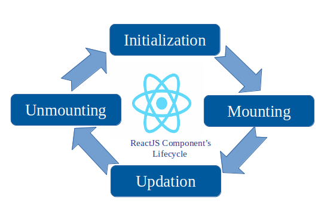
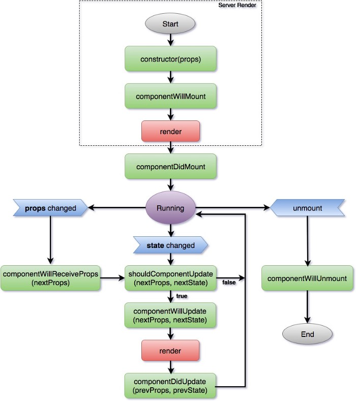
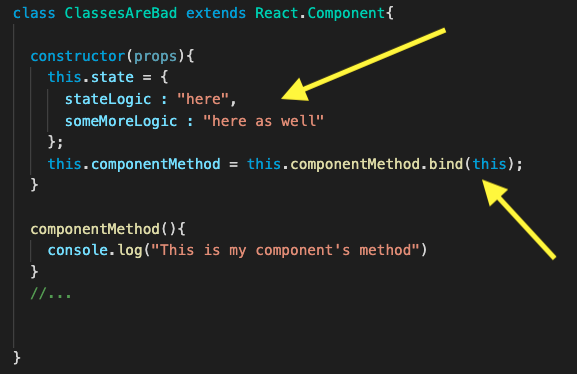

# Getting "Hooked" on React Hooks
Why Switch From Writing Class-based Components To Hooked Components?
# The Problems With Classes
From when JavaScript ES6 back in 2015 introduced Classes to the language to late 2018, React.js only supported one way of creating components with complex logic: [**classes**](https://reactjs.org/docs/react-component.html). Classes supported everything that made React websites dynamic from state logic to handling the component lifecycle.

There were a couple of major flaws with classes from the get-go, however.
main problem with classes however, was that the component lifecycle forced an unintuitive style of thinking and overall confusing to implement.

## Writing Class-Based Components: WHEN do you things happen?

**INSERT CHART FROM SESSION HERE**

## Hidden Logic behind Necessary Boilerplating
Since JavaScript is a functional programming language, creating React Components through classes also added an unnecessary level of complexity with the amount of boilerplating and restrictions that classes require.

## Hooks simplify logic and add readability to components.
When [React Hooks](https://reactjs.org/docs/hooks-faq.html) were introduced to the world during React Conference 2018, they changed the mindset of creating complex React components and became the recommended way of creating them over Classes.

### "With hooks we separate code not based on the lifecycle method name but based on what the code is doing" - Dan Abramov, React Development Team Member

## Writing Hooked Components: WHAT Do You Want To Happen?

**INSERT CHART FROM SESSION HERE**

# Converting From Classes To Hooks

## Binding to this --> Functional [Closures](https://developer.mozilla.org/en-US/docs/Web/JavaScript/Closures)

## this.state / this.setState --> [useState](https://reactjs.org/docs/hooks-state.html)

## componentLifecycle --> [useEffect](https://reactjs.org/docs/hooks-effect.html) (and a couple more we'll cover later)

# Conclusion
Hooked components reduce the boilerplating necessary for Class-based React Components, and stick true to JavaScript being a **functional** programming language as opposed to an Object-Oriented one.
