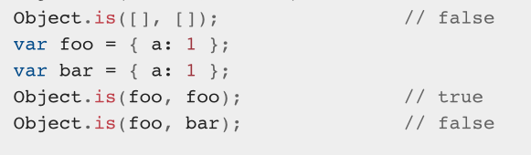
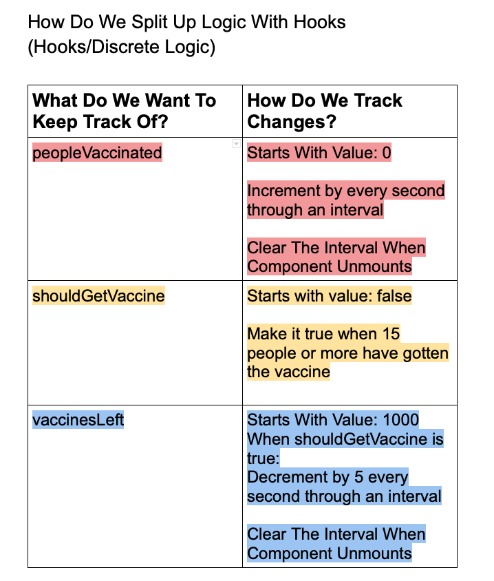
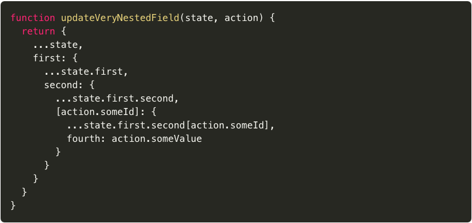
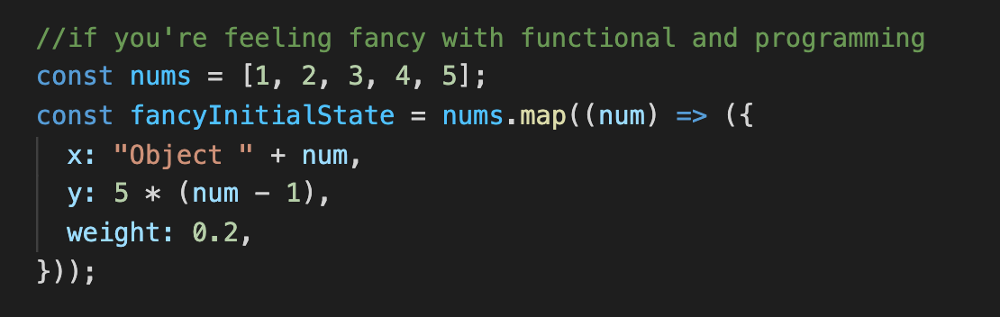
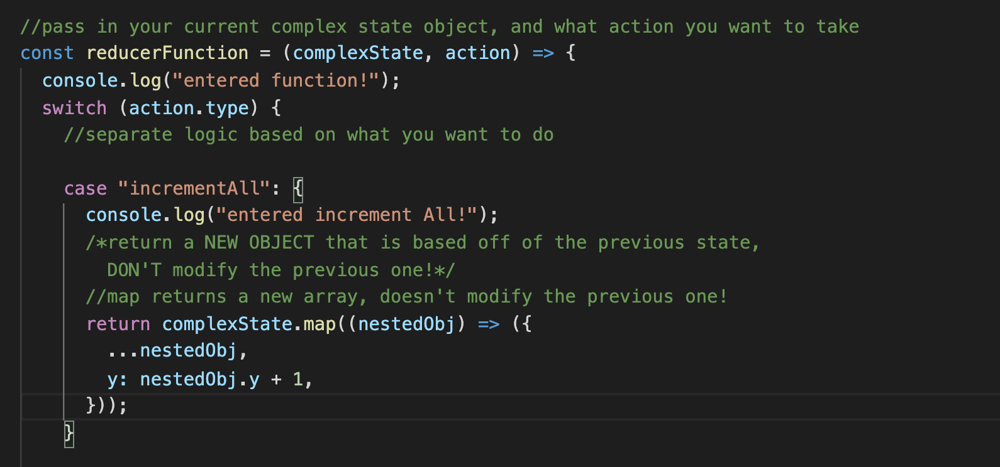
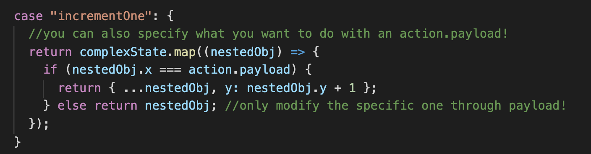
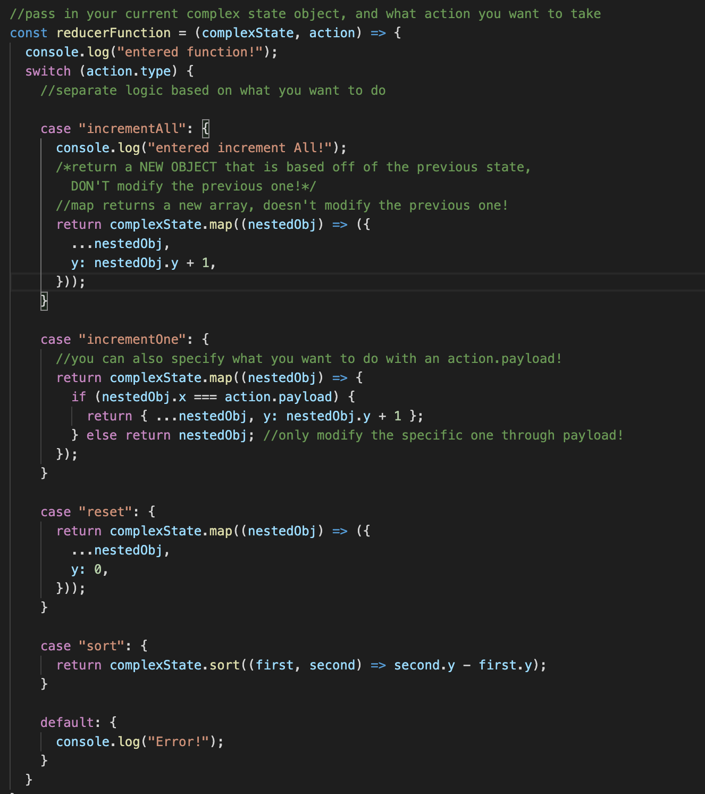
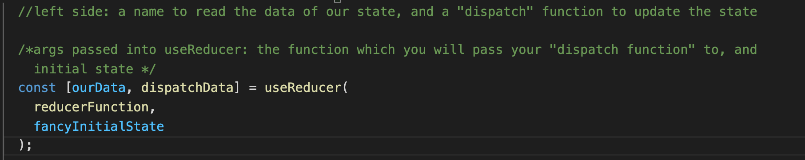
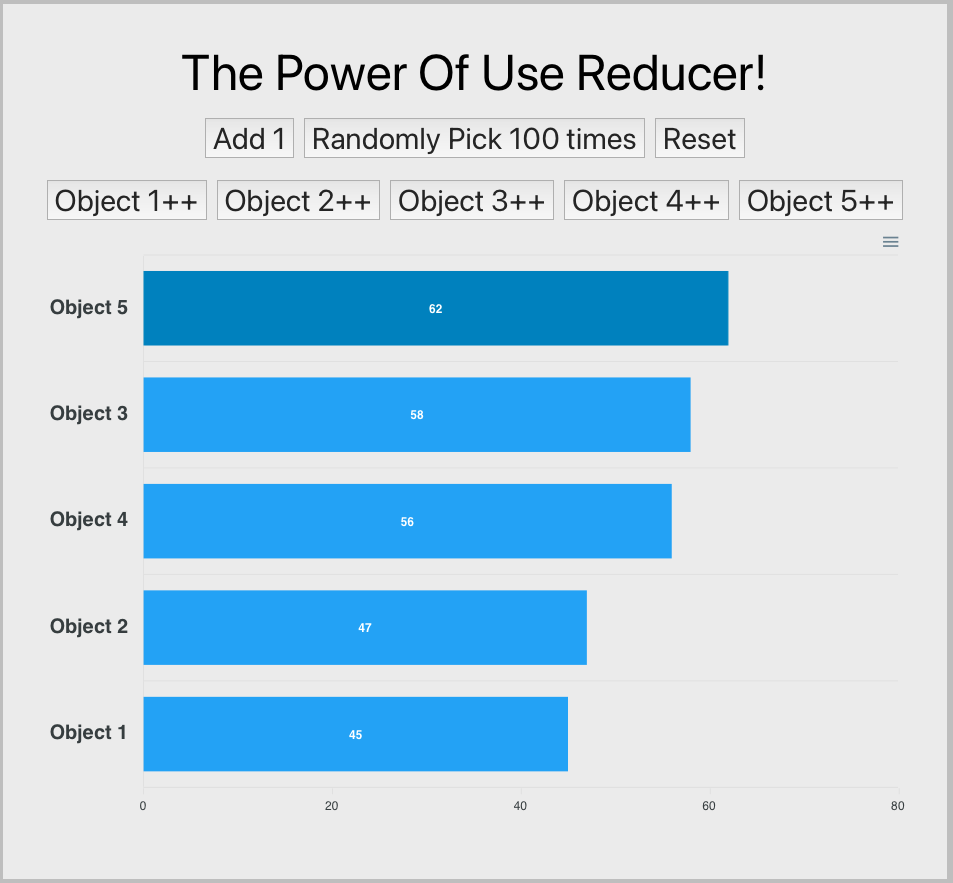

# Nested State of Mind

Earlier during the first session, we discussed how functional components can handle logic updates with
the `useState` hook!

However, today we will discuss how state management is a bit more involved for nested data like objects, arrays, and how new features of JavaScript/React like the [**spread operator**](https://developer.mozilla.org/en-US/docs/Web/JavaScript/Reference/Operators/Spread_syntax) and the `useReducer` hook help simplify things!

# Nested State in Conjunction with the useState Hook

With the **useState** hook, the developers of React have added a level of optimization with `useState` and `useReducer`! Unlike the regular `this.setState` of React, React [doesn't trigger a re-render](https://github.com/facebook/react/blob/master/CHANGELOG.md#1680-february-6-2019) if the previous state's value was equal to the new state's value when you use `useState`, using an [`Object.is`](https://developer.mozilla.org/en-US/docs/Web/JavaScript/Reference/Global_Objects/Object/is) comparison

## What's the problem with this?

Do you guys remember the tried and true [] !== [] example of why JavaScript is funky?? That's because JavaScript compares the references to the objects (like pointers) to determine equality.

## What Can Go Wrong In React With This??

A couple weeks ago, we discussed how one of the great things with the useState hook is that you can separate all your logic into discrete parts.

However, what if we need to store non-primitive values into state, like JSON objects or arrays of data?
If we only want to update specific fields of an object or an array, useState won't cut it!
(technically you can still do it, it just gets REALLY convoluted and why do it that way when React provides a better solution to us? If you're curious, here's an example of [some code](https://github.com/uclaacm/bias-by-us/commit/6ca3dfb789ee7d9fc2a74dc7b122eab3b1dd0843) I wrote that is really gross using `useState` and compare it to [how clean](https://github.com/uclaacm/bias-by-us/commit/fc1831537061a00474f2ce47ca435217456657f2) it can be with `useReducer` which we'll learn today!)

# The JavaScript Spread Operator

With the spread operator, we can create "deeper" copies of objects as opposed to "shallow" copies.
Deep copies are not connected to the original data, while shallow copies are "connected" to the data
by having the same reference pointer! (Which is why you get some non-update shenanigans sometimes, React uses `Object.is` to check for equality!)

# What's useReducer?

useReducer is a React hook that is similar to one feature of the previous state management tools that was not native to React at the time, [Redux](https://react-redux.js.org) and helps manage complex "nested" state!

# How Does [useReducer](https://alligator.io/react/usereducer/) Work?

Reducers are a bit more complex than the two other hooks we've looked at so far in that you have to set them up both outside your react component you want to use them in, and use them within the component!

# Reducer Set-Up Outside Your Component

When you first set up a reducer, you have to set up your initial state that you want to pass in.

A reducer function is a bit chonky, so let's break it up into parts!

# Reducer Function Set-Up

Inside of a reducer function, you pass in two things

- your complex state object
- an action to take

Inside of your case statement, you return a modified version of the previous state through **immutable update logic.**

(If you need a refresher on immutable update logic and the functional programming paradigm, check out our [Session 2 write up](https://github.com/uclaacm/teach-la-dev-training-s21/tree/main/advanced_react_track/02_fun_with_functions) all about it!)

With the use of the spread operator, we can say that we want to keep the rest of the object the same **EXCEPT** for the parts that we want to change! This doesn't modify the original state passed in, but instead creates a **new object based off of the original state.**

# What if there's something specific you want to do?

By passing in a payload inside the action object which gets passed into your reducer, you can do specific things to only parts of your function! In this case, by passing in the name of the specific object we want to reduce, we can specify only incrementing one part of our nested state.

Here's how our entire function will look like after specifying a bunch of action.type cases!

# How do we use our reducer inside our React component?

The set up for using a reducer is similar to useState, by putting in a "getter" for your reduced state and a function called a "dispatch" that modifies your reduced state.

## Using Our Dispatcher

Using a dispatcher, we can pass in our "action" object which we set up earlier to handle changes to our
nested state object.

# In Conclusion

In conclusion, the usage of reducers help us handle complex state when things can get unruly and help to reinforce our functional programming paradigm of having **immutable variables** and data transformation!

