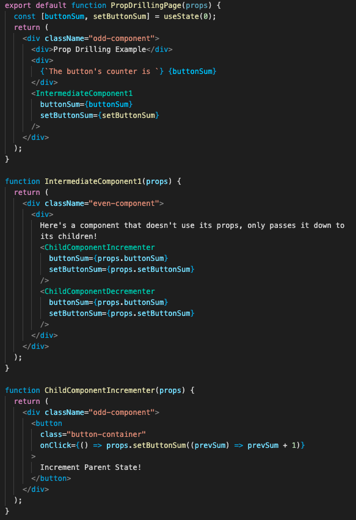

# Global State of Mind

Last week, we discussed how the use of the `useReducer` hook helped to centralize state logic. Today, we'll talk about how the `useContext` hook can help to centralize state logic further and its pros and cons compared to "prop drilling" with React Components.

# What is ["Prop Drilling"](https://kentcdodds.com/blog/prop-drilling) Before State Management Tools Existed?

**Prop Drilling is the practice of passing down logic that is used across multiple components within React Component trees.**

# Pros of Prop Drilling

- With prop drilling, you are explicit about which child components need logic, and make each child component simply a consumer of the state logic used up above in the parent component.

- The flow of code is **linear** which means the exchange of logic only goes one way: parent --> children

- When you use prop drilling, child components that use props passed down from the parent component don't listen to **ALL** state changes in the parent component and only change what they display accordingly when the props passed down to them change.

# Cons of Prop Drilling

- As you pass down props through more and more React components, it becomes harder and harder to add or remove logic from the "thread." In order to add or remove logic, you'll have to add or remove props through EVERY single component within the component tree. This can get annoying fast, and it can be easy to forget adding/removing props accordingly!
- If one component in the component tree doesn't rely on state logic of the parent but still has to pass it down to its children, the intermediary component receives props it will not use, in the concept called **over-forwarding props.**

- If you rename the props to something else, it gets very confusing which props correspond to state logic.

# How Do State Management Tools Solve the Problems?

Before React had state management tools built into the framework like `useContext` and `useReducer`, users had to rely on 3rd party state mangement tools like [React Redux](https://react-redux.js.org) or [Flux](https://facebook.github.io/flux/) to **centralize state logic.**

# Why would you want to centralize your state logic?

As discussed with prop drilling up above, having to "thread" your state logic across multiple components makes it cumbersome to remove or add props from the entire component tree, and is prone to user error of forgetting one here or there.

By centralizing state logic, we can achieve **global state** (only within the block scope, but we'll get to that later) which makes it easy to add and remove logic for an entire component tree.

Going back to the image above...

Centralized state logic allows us to provide _context_ for an entire component tree and make changes in one component be reflected across the entire tree.

Like we have discussed last week, the `useReducer` hook is a way to centralize state logic for a single state instance by handling complex state with different action types and payloads. This week, we will discuss how the `useContext` hook and `React.createContext` allows us to centralize state logic across an entire component tree, not just a singular instance.

# The [`useContext`](https://reactjs.org/docs/hooks-reference.html#usecontext) Hook and React.createContext

Similar to `useReducer`, context in React requires set-up both outside the component tree you wish to use it in and set-up inside the components as well.

# Context Set-Up Outside of Component Trees

First, you have to create a context object that will be passed down to components in its context. If it is a static value that will not change, you can initialize it to the value within the context object. Otherwise, if you want to pass down state logic to multiple components, you can pass in an empty object and add in the state logic later.

Once you have created a Context object, you must also create a Context Provider which will give the context to all "consumers" of the context. If your context is a static value, you can simply pass in its value in the `value` prop field. Otherwise, if you want to pass down state logic to consumers of the context, you must create a **Higher Order Component** which passes down state logic to its children through `ContextName.Provider`.

# What is A [Higher Order Component?](https://reactjs.org/docs/higher-order-components.html)

A Higher Order Component, also called `FragmentContainers` in other state management tools, is a way to reduce rewriting code by creating a **template** for components that all rely on similar logic.

**EXAMPLE:** What if we wanted multiple components that all needed the same state variables? Making a template through HOC's help us centralize state logic in one place.

Inside HOC's with React Hooks, we can do everything we do with usual components like `useState`, `useEffect`, etc. and **provide** the logic to children components (through `props.children`)! In the future we'll discuss how other concepts in React like custom hooks help to reduce rewriting code as well.

Once you have created your Higher Order Component, simply wrap everything inside of it to give the context to everything within a component tree!

# Context Set-up Inside Component Trees

Unlike with prop-drilling, you do not have to write all your state logic that you want to keep track of inside of the parent component of the tree.
Instead, you can selectively choose parts of the context that you need by simply calling `useContext` with the context object.

You can only `useContext` if somewhere above in the component tree (either the component or one of its parent components) is wrapped inside of the `ContextName.Provider` HOC.

To use the context, simply destructure the value object of the context with the `useContext` hook, and pass in the `contextObject` to which your context provider is wrapped inside.

Let's take a look at how context and the concept of HOC can allow for the **separation of concerns** on a wider scale, which means that we can create components that handle state logic and create separate children components that are solely responsible for displaying content.

## Here's how it looks with Context and Separation of Concerns

## And Here's how it looks like with Prop Drilling!

**NOTE:** While I said earlier how React context is similar to "global state", it is actually only global with respect to its component tree! Every instance of context has its own logic and is completely independent of each other! If you want to learn more about how this is possible in JavaScript with the concept of block vs function scoping, this is [a really nice write-up](https://josephcardillo.medium.com/the-difference-between-function-and-block-scope-in-javascript-4296b2322abe) all about how this type of scoping is possible!

# Pros of React Context

- The concept of Higher Order Components allow for the separation of concerns (separate components for state, separate components for rendering)

- You avoid having to rewrite code if multiple component trees need the same logic

-Easier to add and remove state logic from component trees since it's centralized inside of the context object.

# Cons of React Context

- Whenever **anything** inside the context object changes, React forces a re-render of everything that depends on the context.
  (If within a component tree a component is wrapped inside a `Context.Provider`, that component and all its children will re-render with changes inside the context object.)

- Be careful when you `useContext`, don't slap it in everywhere! Be aware that it will force re-renders whenever context objects change, so `useContext` in cases where most/all components in a tree will be re-rendered anyways so that this is not an optimization concern.

- The separation of concerns delinearizes the flow of logic from parent->child since the child components can directly change logic within the context as well.

- More setup required than simply making state logic inside the parent component.

# When Can Context Be Useful Compared to Prop Drilling?

- Keeping track of users logged in, letting them log in and out without having to pass down `props.user` throughout your entire app

- Handling App-Wide behavior like a light/dark mode [(yoinked from this tutorial)](https://dev.to/sorinc6/light-dark-mode-toggle-with-react-using-context-api-and-styled-components-347i)

- When multiple react component trees all rely on the same logic and you want to avoid prop drilling

# Conclusion

There is no right and wrong answer for whether you should choose Prop Drilling or `useContext` for state management across an entire component tree. You should take a look at the pros and cons of each and see which one works best for your current use case!

