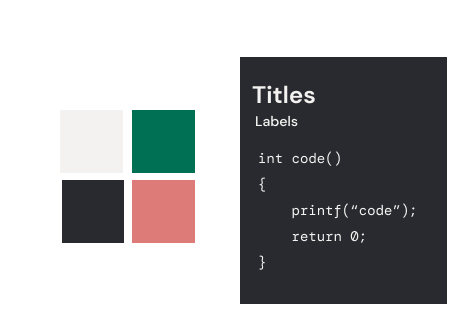
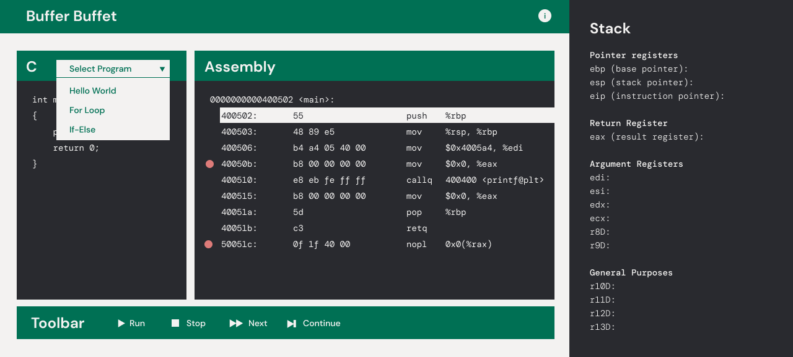
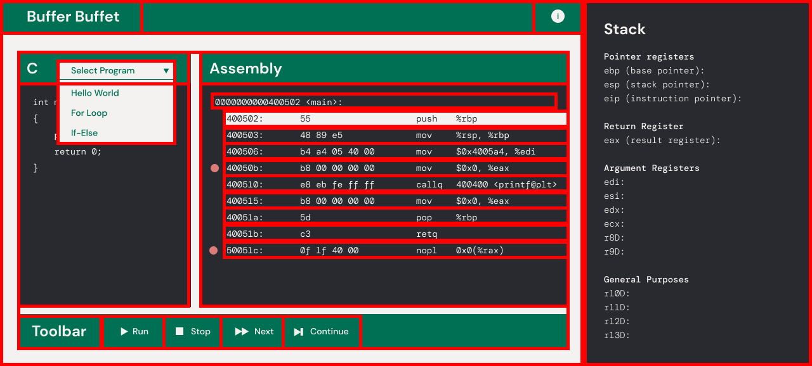
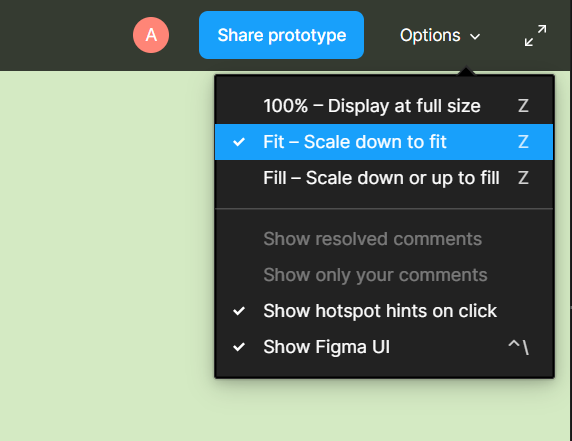

# Design Drama

Hello, person reading this! I'm Archie, the design director, and today I'm here to talk about designing efficiently for the web. We'll talk a bit about good design practices, prototyping, and converting a design to a static website.

I'll be using [this Figma](https://www.figma.com/file/imjCN1TlQCXBvVCGKqKv1U/Design-Workshop?node-id=0%3A1) for demonstration purposes. Feel free to follow along!

## Style Guides

Style guides are a really important part of creating an efficient design to dev pipeline. They're basically the place where you keep all your colors, fonts, and design rules! If you want more information about how to create a good one, check out last weeks workshop. For now though, let's assume you already have your colors and fonts picked out. Here's a very basic one as an example.

To take this up a notch, we'll take advantage of a Figma feature called **styles**. Think of styles like an HTML class! We can make multiple elements of our page look the same using a single style.

### Color Styles

To create a color style, click the four dots next to the color. 

Then, click the plus icon at the top to create a new color style!

Now you can edit the color style by right clicking on it and clicking `Edit Style`. If you have multiple elements with this color style, they will all change at once. How convenient!

### Text Styles

Text styles are done in a very similar way! Click the four dots next to the text and then the plus button to add a text style.

### Why are styles important?

As we've seen, styles let us change multiple elements at once. But here's another secret: they give us an easy place to access the CSS version of the style. First, select an element. On the right-hand menu, navigate to the "Inspect" tab. In the "Code" section, you'll find the CSS for it! Groovy :)

**Note:** Typically, we will only use the font/color information not the position information. That is because we don't want to be using absolute positioning for all our elements!

## Visualize the Boxes

What are some of the most important structural elements of a website? Divs, grids, and components! In this section, we'll talk about how to take advantage of this structure. Let's take a look at this flatpage for Buffer Buffet. (Check out the final website [here](https://bufferbuffet.uclaacm.com/) hehe).

What elements do you see? Let's break up the page into sections. 

Which parts need to be a grid? Which parts need to be React components? In your design, choose your groups so that they align with the HTML structure of your page. For example, we should have a Toolbar group in the example above. When you convert your design to code, you can copy the structure directly into HTML! 

## Prototyping

Now that we have the tools to structure our page, let's talk about how to get a sneak peek of the finished website. Prototyping is one of Figma's most powerful tools! Prototypes are a fantastic way to:

* Preview interactions and user flows
* Share and iterate on ideas
* Get feedback from collaborators
* Test interactions with users
* Present your designs to stakeholders

This is especially helpful for very large companies. However, since TeachLA generally works in smaller teams, we won't need the full power of this tool. Today, we'll just cover the basics.

### Viewing a Prototype

Click the play button in the top navigation panel to open your prototype in a new window!

From here you can select the sizing you want. If you want to see what it would look like as a real website, click fill. If you want to see the whole frame, click fit. To take away the Figma UI, use `Ctrl./`. 

### Prototype Settings

Without selecting a specific element, click over to the "Prototype" tab on the right-hand menu. Here, you can choose what device to display your prototype on, the background color, and the starting frame. 

### Interactions & Animations

Finally, the fun stuff! Interactions are a big part of prototyping. Let's start with the most basic one: navigation. Suppose we want to navigate to the home page when we click the title. First we select the title. Then, navigate to the "Prototype" tab on the right-hand menu.

Hey, look at that new white circle on the side! If we click and drag, we can make an arrow pointing to any other element. In this case, let's point it to our home page frame. This arrow is called a **connection**. When we make connections between elements, we can create an **interaction**.

The default interaction will be to navigate (action) on click (event listener), but feel free to play around with the different event listeners and actions. 

### Overlays

Now navigation is a big part of prototyping, but what about some more complex stuff? Let's say we want the instructions button to open up the instructions frame as an overlay. We'll make a connection from the button to the frame the same way we did before. This time, we'll change the action to "Open Overlay". Here, we can choose the position of the overlay, the background color, the closing mechanism, and more!

### More Info

Check out this [link](https://help.figma.com/hc/en-us/articles/360040314193-Guide-to-prototyping-in-Figma) for more info about prototyping!

## Responsive Design

Unfortunately, we don't have time to get into responsiveness in-depth today, but it's a super important part of web design! Here are some main points:

As a bare minimum, design both a desktop and a mobile version of your site. I would also encourage you to think about what your site should look like on large monitors or tablets!

The inspect tab is a great tool while developing! Click this button to see what your page would look like on different screens. 

Select "Responsive" to easily resize your screen. 

Constraints are a really cool feature we didn't have time to cover today! They help make your design responsive. Check out [this link](https://help.figma.com/hc/en-us/articles/360039957734-Apply-Constraints-to-define-how-layers-resize) for more information.

## Exporting Graphics

When you get a design from a designer (often me lol), it'll sometimes come with illustrations! Obviously you don't want to sit there and draw every single shape as an SVG, so what do you do? You export it! First, select the illustration. If it isn't already a group of some kind make it one (`Ctrl + G`). On the right-hand menu, go to the "Design" tab, scroll down to "Export" and click the plus button. When working with vector illustrations, always export as an SVG not the default PNG. SVGs are smaller files and more scalable than PNGs. Then, click the export button.

## Further Reading

If you would like to read up on basic design principles, check out the [workshop](https://github.com/uclaacm/teach-la-dev-training-s21/tree/main/react%2Bmisc/4_figma_and_design) I did last week. This covers layouts, color schemes, fonts and more!