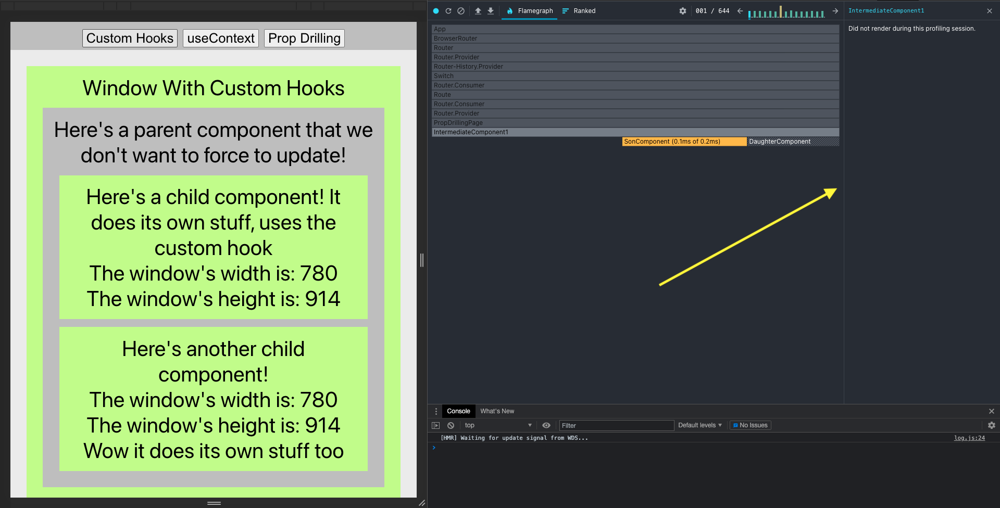

# Accustomed To Custom Hooks

For the past couple of weeks, we've been discussing how a lot of the tools/practices that we use/follow when making React apps can help organize code and make it more readable:

- Compartmentalization of state logic
- Hooks like `useReducer` and `useContext`
- Functional Programming Paradigm
- Higher Order Components
- Separation of Concerns
- 
  This week, we'll talk about how custom hooks embody all of these concepts and **why/how** we would use custom hooks to clean up our code!

# How Do Hooked React Components Handle State Logic?

"With hooks we separate code not based on the lifecycle method name, but based on what the code is doing"

One of the great things with React hooks is that we don't need to keep track of one giant `this.state`, but can instead keep track of each state variable discretely and independent of each other.

## Hooked Functional Components

## Class-Based Components

# What Can We Do With Discrete Logic?

With discrete logic, we can take advantage of "separation of concerns." One way we've looked at before that does this is by separating complex components into ones that only handle state logic and ones that only handle displaying content onto the screen.

Hooks do the same thing, by **combining logic that is discrete from other parts of the application and self-containing it to its own individual function.**

You're basically making your own APIs for use within your React Apps!

# How do Custom Hooks Work?

At their core, custom hooks work just like functional composition within the functional programming paradigm.

## Functional Composition

In this example of functional composition, you can simply call the child function inside of the parent functions if they share the same logic to prevent code reuse.

Hooks do the exact same thing! If two components share logic that can be encapsulated into a separate component, you can create a **custom hook** which you can call multiple times within different React components!

Within custom hooks, you can use all the same tools we've discussed in the past like `useState`,
`useEffect`, `useReducer`, and more! At their essence, custom hooks act the same as **higher-order components**, where you can inject more logic into a pre-existing component with your data!

They are like React components, except inside their return statement, instead of containing JSX, you return data that React components can use!

# Why Use Custom Hooks?

Hooks are useful for repeated, compartmentalizable logic that is used multiple times throughout an application, or when you want to separate your logic into different functions.

## Differences Between useContext and custom hooks?

The use cases for custom hooks sounds very similar to useContext, so let's look at an example that can be used either way and compare the differences between them!

## The custom `useWindowDimensions` Hook

**GOAL**: Create a way to get the window dimensions of the browser, and update in real-time to state changes throughout multiple components of the app.

- Without custom hooks, how can we achieve this functionality?
- What are the drawbacks of these methods?

## How Do Custom Hooks solve the problem?

- Performance problems of wrapping your entire app inside the window dimension's context are solved because you only need to call the custom hook inside the components that depend on its logic.
- Code overuse and prop-overforwarding of prop drilling are solved because you only have to write the code to handle the logic **a single time**.

# Making [Custom Hooks](https://reactjs.org/docs/hooks-custom.html)!

When making custom hooks, all the [same rules](https://reactjs.org/docs/hooks-rules.html) apply to regular React hooks.

- Only Call Hooks from React functional components or custom Hooks.
- Only call them on the top level of your components (NOT within subfunctions, for loops, if statements, etc)

# Creating a custom hook function

When making a custom hook, it is convention and best practice to start its name with `use` so that we know that the [rules of hooks](https://reactjs.org/docs/hooks-rules.html) apply to it.

Inside our custom hooks, we can use the `useState` hook just like in a React component!

In this example, we set-up event listeners inside a useEffect which handles updating all the state logic from **within** the custom hook itself!

When you return the value of your custom hook, you can return a value that you use like any hook!

For instance, the `useState` hook returns an array of your state variable and a function to set your state.

In our custom hook, we can return an array of both the window's width and height!

## Using A Custom Hook

Just like a child function within function composition, you can call your custom hook, and all the logic of how it works is hidden inside the custom hook. For the developer using the custom hook, it's just like calling an API!

You can call your custom hook from any React component, and through [lexical and block scoping](https://dev.to/sandy8111112004/javascript-introduction-to-scope-function-scope-block-scope-d11), each instance of the custom hook is separate from each other and can be used in multiple places at once!

# Custom Hooks Can Improve React App Performance!

By using the [React Developer Tools Chrome Extension](https://chrome.google.com/webstore/detail/react-developer-tools/fmkadmapgofadopljbjfkapdkoienihi/related?hl=en) we can "profile" our React apps for performance and see how many times our components have to re-render!

Let's take a look and compare the performance of each of the three approaches: custom hooks, context, and prop drilling, and compare how many times the "parent component" is forced to re-render even if it doesn't care about logic that only its children component use.

## Custom Hook Performance

## Context Performance

## Prop Drilling Performance

As you can see, both context and drilling both require costly re-renders while the custom-hooks don't require parent components to unnecessarily re-render, which can improve performance **dramatically!**

# When Would You Want To Use Custom Hooks?

Custom hooks are another tool we can add to our toolkit of organizing React code and writing better, cleaner, and more efficient code!

## Instagram

Inside Instagram, you can see a list of people you are following and their display name/username.

However, inside a database, people are represented by UID's, and you have to match up the display name to the UIDs.

If you want to be able to see the names of people you're following within the app but only contain it to the specific parts of the app where you have to display them, you can build your own custom hook that handles all of the logic.

Unlike with context, you won't have to force an update across the **entire** application each time the friends list updates, and only contain the updates to the parts that rely on that logic!

The website [useHooks.com](https://usehooks.com) has a lot of great examples of custom hooks that you can implement in your applications!

# Conclusion

In conclusion, custom hooks take advantage of all the concepts we've discussed so far:

- Compartmentalization of state logic with hooks as opposed to class-based components
- Function composition of the functional programming paradigm
- Separation of Concerns with Higher Order Components
- Centralization of State Logic

Hooks are useful for repeated, compartmentalizable logic that is used multiple times throughout an application, or when you want to separate your logic into different functions. They are a really powerful tool that help to clean up, organize, and optimize our code!
