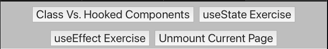
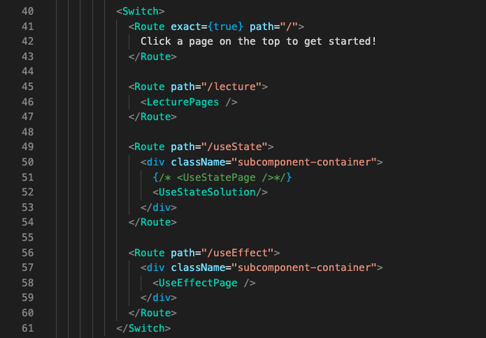

# Why are you making us fork a repo for practice??

As you get onto more projects, it's an important skill to handle being onboarded to existing code-bases and developing new features! (If you don't like this style please tell me!)

# Navigating Around This Exercise!

This Exercise was set-up with React Router (which we'll cover later) to generate three practice pages.

- Converting Class-Based To Hooked Components
- Implementing useState
- Implementing useEffect

## Simply use these buttons on the top to navigate between different pages

## To view solutions, you can change the components that are rendered in App.js

# Solutions and Explanations (Added After Thursday!)

## Class-based --> Hooked Solution

## Implementing useState Solution

## Implementing useEffect Solution
