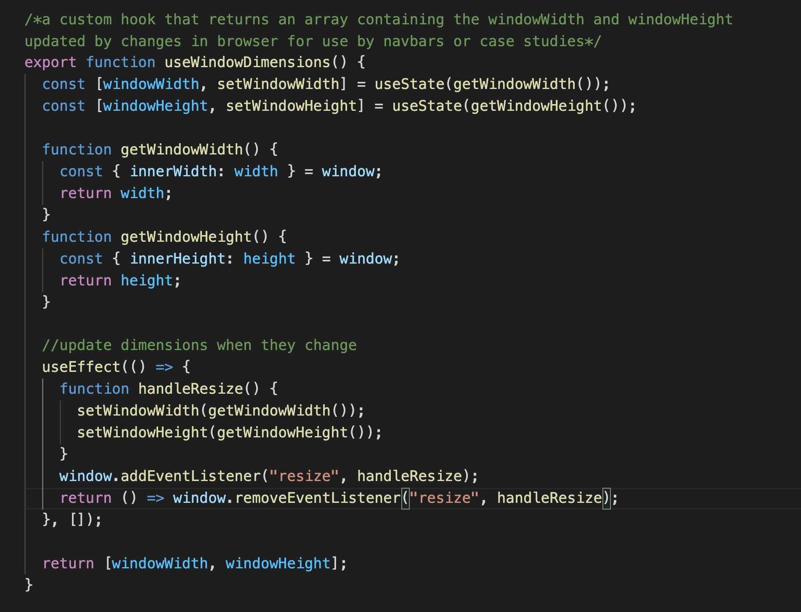
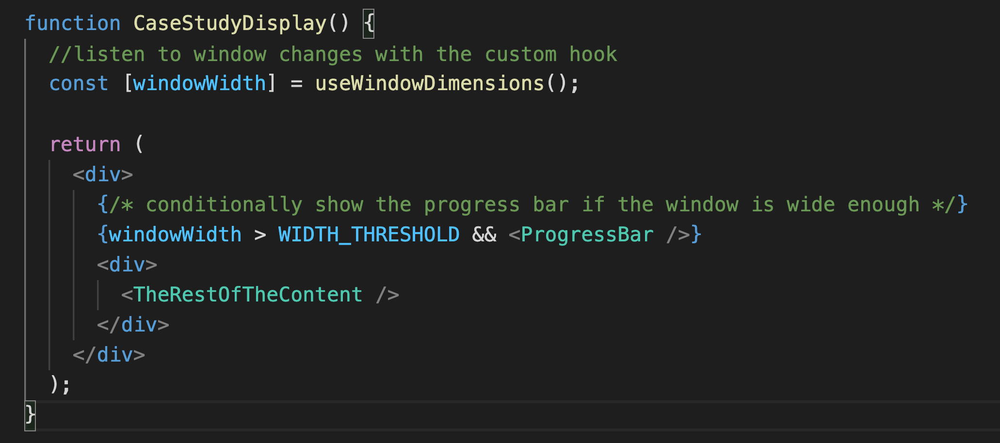
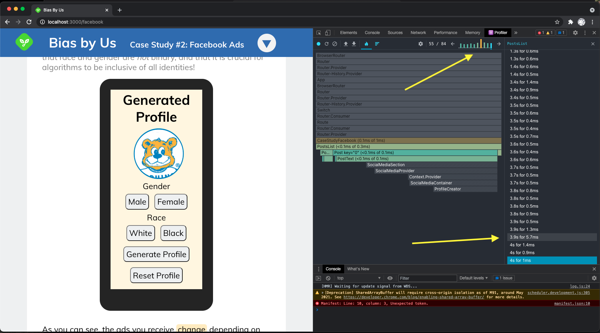
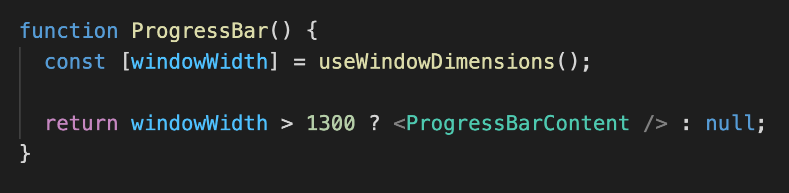
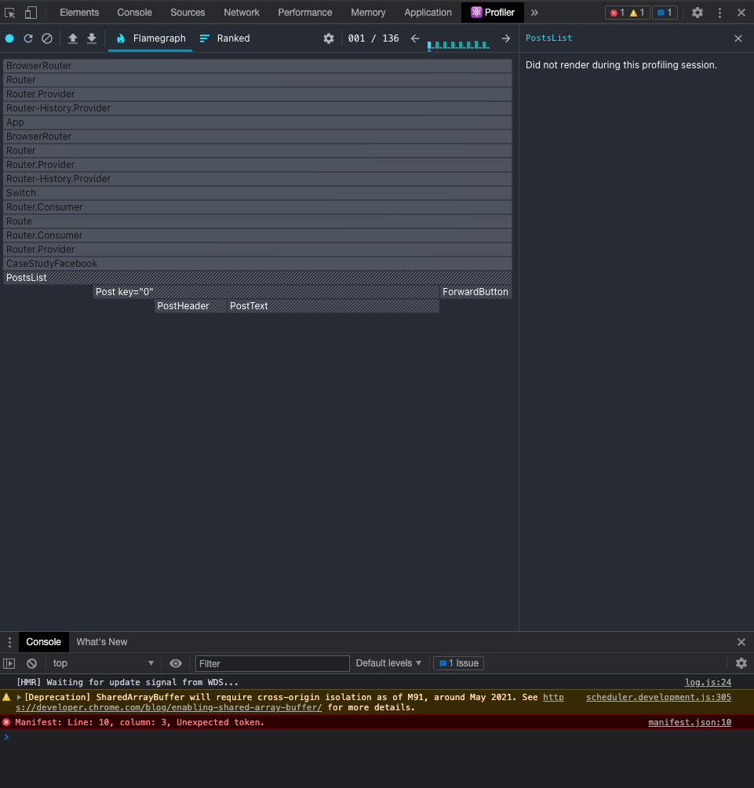
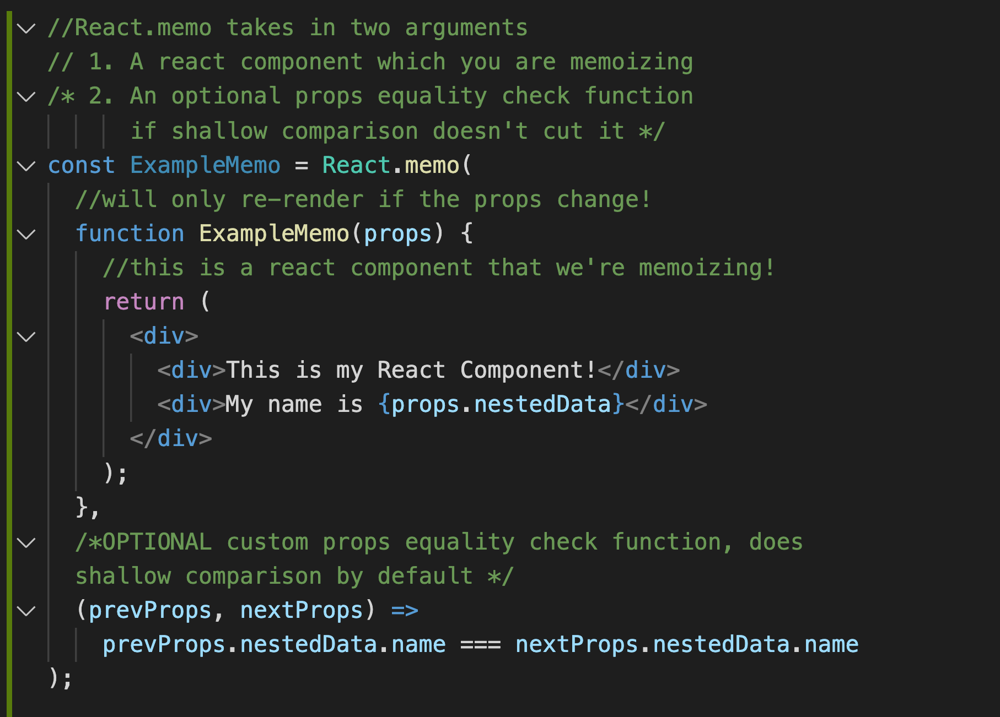
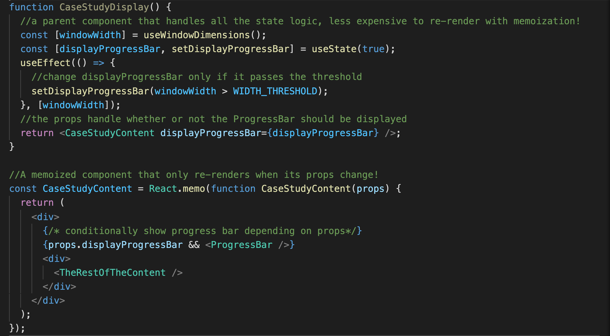
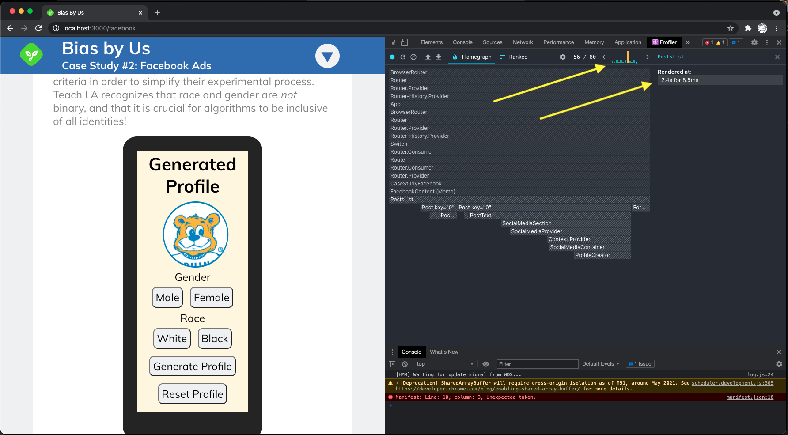
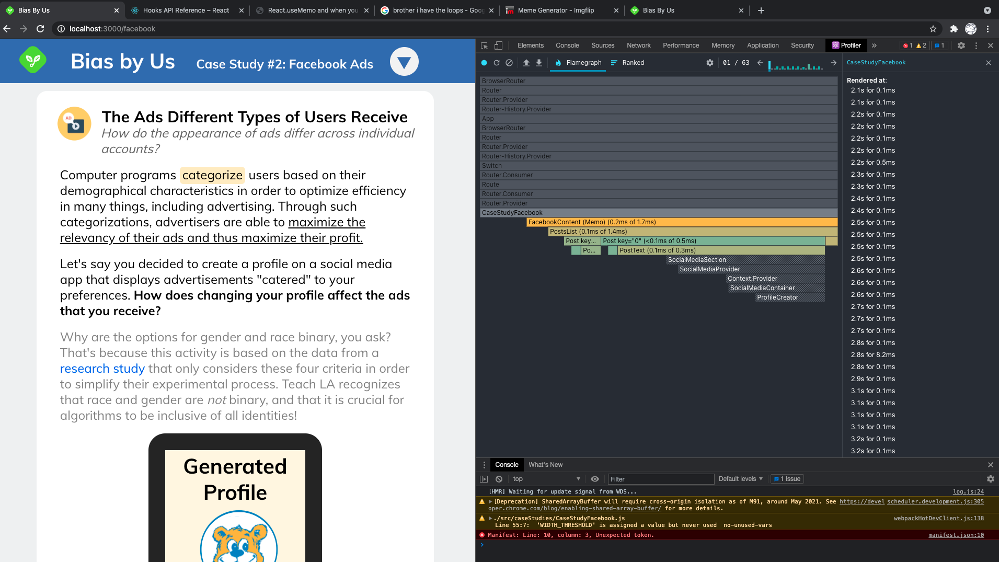

# The Memo on Memoization

Last week, we discussed how we could view the performance of our React Apps with React Dev Tools and saw first-hand how Context forces re-renders of everything that's a consumer of the Context.

This week, we will discuss the steps we should take to improving our code's performance, and learn about the concept of memoization! First, let's take a look again at performance differences within the profiler of `React Dev Tools` between context and custom hooks.

## Context Performance

Everything wrapped within the `Context.Provider` has to re-render, including the gray `IntermediateComponent` which we specifically DO NOT want to re-render if it's expensive to!

By using custom hooks, we have seen how the compartmentalization of logic can help stop the unnecessary re-rendering of parts of an application that don't depend on the changing logic. By looking at the profiler, we were able to see that the `IntermediateComponent` was not forced to re-render!

## Custom Hook Performance

The intermediate component isn't forced to update due to us using the custom hook within each child component instead!

# However, Custom Hooks Aren't A One-Size Fits All Solution

While custom hooks in this case were able to prevent rerenders on the parent component (`IntermediateComponent`), custom hooks raise a new set of problems if multiple children components within a tree depend on the same logic.

For instance, with our usage of the `useWindowDimensions` custom hook, we have to set up two event listeners for the window width at the **same time** due to both children components both individually using the `useWindowDimensions` hook. In a bit, we'll take a look at how we can address this with memoization! But first, let's break down why custom hooks with state logic cause re-renders.

## The useWindowDimensions custom hook

However, our example of using the `useWindowDimensions` hook isn't really helpful in terms of talking about optimization, so let's take a look at an example where we actually use the window dimensions to determine what should be displayed on the page!

# An Actual Use Case For Our `useWindowDimensions` Hook

Let's take a look at one of our Learning Labs, Bias By Us! In this learning lab, we want to conditionally render the bar on the left side of the screen only if the `windowWidth` is wide enough.

Essentially, with this simplified version of our code for this section, we use the custom hook to listen to changes and only rerender the progress-bar whenever the windowWidth goes past a certain amount.

## The Problem With This Approach

Since `useWindowDimensions` is a custom hook that we created, it's essentially an abstraction of the original logic which depends on both `useState` and `useEffect`.

Since a React component re-renders whenever any of its state variables change, changing the windowWidth of the browser causes everything within the page to re-render, even when it **shouldn't** have any effect on the page's content!

For instance, looking back at our representation of the code, we can see that the only time that the page's content actually changes is whenever the `windowWidth` variable goes above or below the `WIDTH_THRESHOLD` variable!

However, when we take a look at our code with React Dev Tools, we see that the rest of the content has to get re-rendered **multiple** times. This is due to the fact that the custom hook comes with `useState` and `useEffect` logic under the hood, causing the entire component to re-render when state changes. We'll go through the steps you can take to figure out how to prevent unnecessary rerenders!

# The Steps Of Improving React App Performance

Whenever performance becomes an issue within your React Apps and you want to optimize code by preventing unnecessary rerenders, you should follow these two steps in this order to address the issue.

- Move around your code's logic or restructure it in such a way so that only the sections directly tied to the logic update as necessary.
- If your problem can't be solved by simply moving around your code's logic, then memoize specific parts of your application. _(but only if it's worth it!)_

Let's see how we would use both methods (although the first is preferred) to help optimize the performance of our example with the Bias By Us learning lab!

## Code Restructuring

The first step of figuring out if restructuring code can prevent unnecessary re-renders is by determining what renders should be _necessary_. By doing this, we can analyze both our code or the website itself!

Taking a look at the webpage alone, it seems as though only the progress bar on the left is affected by the changes in the window width.

And by looking at the code, we can see that the only thing in the code that depends on the windowWidth is our progress bar!

## What Code Restructuring Can Solve

As we just discussed above, react component trees re-render whenever their state variables change. After taking a look at our code and seeing that only the `ProgressBar` component depends on the windowWidth, we can optimize our code by moving the logic that depends on `windowWidth` to just inside of the `ProgressBar` component!

Instead of conditionally rendering the progress bar and handling whether or not it should show up inside the parent component, we can move that to the child component and either render its content or null accordingly.

While this seems like a really small change, it ends up actually making a big difference in terms of performance! If we take a look at the React Profiler, we see that the rest of the content on the page doesn't have to re-render whenever the window's dimensions are changed, only the progress bar has to change!

**However...** the main reason that we were able to improve performance in the above example is because only one of the children component within the parent component relied on stateful logic. If we assume for a moment that we would **only** be able to use the `useWindowDimensions` custom hook inside of our top-level component or multiple components within the tree relied on that logic, then we would not have the liberty of optimization through code restructuring.

# Memoization

In cases where code can't simply be moved around to improve performance, we would have to rely on a technique known as [Memoization](https://epicreact.dev/memoization-and-react/). At its core, memoization is the process of avoiding expensive computations. By "expensive computations," we mean operations that take up a lot of data or time like re-rendering big/expensive components or computing/calling expensive functions. (An example of an expensive function would be finding the average of an array of values that's thousands of elements long!)

## How Does Memoization Work?

React Memoization works by **caching** the data that you are memoizing, be it components or functions, and avoids re-rendering the component or recomputing the function until one of its **dependencies** change.

React offers us three methods of memoization that we can use, and we'll briefly cover each of them!

- `React.memo`
- `useMemo`
- `useCallback`

`React.memo` is a Higher Order Component used to memoize React components, `useMemo` is a hook used to memoize the values returned by expensive functions, and `useCallback` is a hook used to memoize functions themselves (this can be useful due to referential equality through the `Object.is` comparison that is used in React!)

# React.memo

Just like the rest of the memoization tools we discussed above, `React.memo` can be used as a way to prevent re-renders unless a component's dependencies change. Unlike the `useEffect` hook which took in two parameters: a function and that runs when a dependency changes and an array of dependencies, `React.memo` combines the two into its first argument: a React component. Instead of explicitly listing out its dependencies, React.memo does it implicitly by making the Component's **props** its dependencies.

In other words, the memoized component will only re-render if its props change, or if the custom props equality check function you write returns false!

If you only store primitive data types like numbers, strings, booleans, etc inside of your props, then you can omit the second parameter of React.memo (the props equality check function) since shallow prop comparison will work! (nested data is always wonky, just like what we discussed in session 2!)

## A look back at the `useEffect` hook!

## How It Looks Compared To `React.memo`

As we can see, React.memo works to prevent unnecessary re-renders if we control when props change. Let's take another look at our example to see how we can use memoization to improve performance as opposed to code restructuring!

## Improving Code Performance Through Memoization

Looking back at our code for our Bias By Us example, we found out that handling the windowWidth inside of the parent `CaseStudyDisplay` function causes `TheRestOfTheContent` to re-render when ever the `windowWidth` variable changes, which is expensive.

One way we can solve this is by creating a parent component that handles the state changes, and uses a Memoized version of the `CaseStudyDisplay` component, and turning the `windowWidth > WIDTH_THRESHOLD` qualifier into a prop that we pass down!

Let's dissect this code example that does just that!

In this example, we broke the `CaseStudyDisplay` into a parent component which handles the state logic, and a memoized child component whose props depend on the state logic of the parent.

Since our child component is **memoized**, we only re-render it whenever its parent props change.

In this case, we don't have to pass in a custom prop equality check function as the second parameter to `React.memo` because our props is a simple primitive boolean and not nested data.

With this small change of memoization, we're able to prevent re-renders to `TheRestOfContent` on the page as well, let's take a look at the profiler!

And since the only thing that re-renders every time the windowWidth changes is our Higher Order parent component, we can see that we're able to reduce the render time for the wrapper component from as much as 1.3ms to as little as 0.1ms everytime, which gives us **7-10x better** performance on average!

## The Memoized Parent's Constant Re-Render Stats

## Vs. The Original Re-Render Stats

(With the original, re-renders without progress bar took about .5 ms while re-renders with progress bar took about 1.2-1.5 ms)

This seems great for our use cases, but why is code restructuring preferred to memoization?

# The Problems With Memoization

## Optimization never comes for free.

With memoization, you will also have to store a **cached version** of the memoized component inside your browser's memory (the dynamically allocated heap memory to be precise!) and it has more overhead that has to get carried for your browser. Everytime your memoized function re-renders, you have to _garbage collect_ the previously cached value by deleting it from memory and recache the new memoized value (which explains why the memoized value takes 7-8ms to re-render as opposed to the 5-6 ms of the default!). This constant deletion and insertion into the heap memory can get very intensive for your browser, which is why **if you constantly have to re-render a memoized component, it's not worth memoizing!**

## Why Was Memoization Okay in Our Example?

In our example with the Bias By Us page, memoization was a good performance move because we only had to re-render the memoized value once instead of 100 times when our component was directly tied to the `useWindowDimensions` custom hook logic. Before you use memoization, you always have to ask yourself: **Is the added overhead of removing and adding to memory each time a memoized component re-renders worth it??** This extra overhead that comes with memoization is an extra thing you have to keep track of which is why code restructuring is the preferred method of performance optimization.

# In Conclusion

In conclusion, through the use of React Dev Tools, we can profile the performance of our apps and see if there's unnecessary re-renders that we are triggering.

- First, you should try to simply restructure your code to see if you can improve performance by moving around which components are tied to logic.

- If code restructuring doesn't solve the issue, you can use React Memoization if it's worth the extra overhead that comes with it!

React offers us three methods of memoization:

- `React.memo` for React components
- `useMemo` for function return values
- `useCallback` for functions themselves

We'll cover `useMemo` and `useCallback` later, but for now we covered the steps we can take to improve performance on a component-wide level with code restructuring and `React.memo`!
