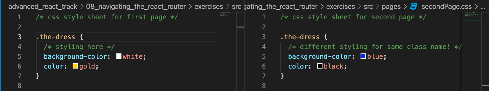

# Navigating the React Router

For the final session of this quarter, we will talk about navigation with React-Router! We've been using it all quarter with the `exercises` website that's set up for each session but in this session we'll discuss how to move around different pages, how React router is different than normal page navigation, and how to pass data to different pages through the URL!

# Fundamental Differences Between React Single-Page-Applications And Multi-Page Websites

With plain websites, when you route to different url's, you link to completely different `index.html` or `index.js` files. However, inside of our react apps, the **entire app** is all contained inside a single statement of our `index.js` file! Everything within React Apps are controlled via the virtual DOM and within a **single page application**.

Now, single page applications normally work just like multi-page applications in principal, but there are a few fundamental differences.

## Things To Watch Out For

- Even if you represent multiple pages through the React-router, you cannot create **different** styles for the same CSS classes inside of your React Apps!

This will not work the way we want to, since the separate css file will be combined into a single file, and you can't provide different styles for the same class name!

When you build your React App, since everything is within a **single page application**, separate styling for the same CSS classes will not resolve the way that you will want it to!

# Representing Multiple Pages Within React Apps

Even though React Apps are single page applications, we can emulate the usage of multiple pages through routing libraries like [`react-router-dom`](https://reactrouter.com/web/guides/quick-start) or [`reach-router.`](https://reach.tech/router/). These two routing libraries are the most popular routing libraries for React applications. (In fact, they're actually combining together in the **very** near future and the merger has been in progress for the past two years!) Eventually, the best parts of each library will give us developers the best experience, but for today we will focus on the `react-router-dom` library!

# [React-Router-Dom](https://reactrouter.com/web/guides/quick-start)

React Router is a third-party router library that emulates multiple pages within a Single Page Application. First, let's go over how we can use it to change our URL and use it to showcase different things on the page!

## Links And Switches

React Router offers a variety of Router types for us to use, but today we'll focus on the [`BrowserRouter`](https://reactrouter.com/web/api/BrowserRouter) that uses HTML5 history API to emulate page navigation just like in normal web applications! To use it, you can simply wrap your app with the `Router` of your choice.

The main way that we can navigate through pages is with Links and Switches!

## [Links](https://reactrouter.com/web/api/Link)

Just like how we can use `a` tags with `href` to navigate across different pages within regular web applications, we can use the `Link` feature within React Router to change the contents of our URL!

Under the hood, the Link tag works like the a tag, but simplifies the process a lot for us developers! To use it, we simply wrap the JSX component that we want to use to navigate across different URLs with the `Link` tag to change what shows up in our URL!

As you can see in this GIF, clicking the page buttons changes the contents of our URL!

## [Switches](https://reactrouter.com/web/api/Switch)

Now that we've taken a look at how to change the content of our URL, how can we conditionally show different things on the screen depending on the URL? To do that, we use Switches and Routes to conditionally show things on the screen. Just like a switch statement, you only display the contents of **one** of the routes, depending on the current URL!

### How do we use switches?

Within a Switch Element, we can pass in multiple components and conditionally render **only one of them** based on the URL. For each route, we can pass in a `path` prop, and the Switch will display the contents of the route if its path is within the URL at all.

**CAUTION:** As you can see in this example, for the base path, or the default path that the website loads in with, **"/"**, we have to specify **exact path** instead of just path. This is because in React-Router in particular, `Switch` statements will render a route if its path is anywhere inside the URL. Since every url path starts with **"/"**, if we didn't specify the exact keyword, we would only render `<FirstPage>` no matter what is inside our URL. (In the upcoming merge with Reach Router however, we won't have this problem since every path is exact in the new version of React Router coming out very soon!)

Here, we can see how the page that we render differs based off the URL

## Passing In Data Through URLs

The URL can be used for more than simply rendering different things on the page. Let's say we want to pass in some data from the URL into the webpage itself (this can be useful for user authentication, chatroom messages, and anything else we might want to store in the URL!). Within our Switch elements, we can use the **":"** identifier in our path to identify a variable that we will use within our children components of the switch!

**Example:** Here, we're going to display what's next in the url after the / and store it in a component!

If we take a look at how this is represented in the code, we can see how we pass in the parameter variable and give it the name `currentsection` inside our path.

Then once we're inside the `Identifier` component that uses the data stored inside the URL, we can grab that data using the custom `useParams()` hook that comes with React-Router. This offers us a way to pass down data across pages without even using React props!

**CAUTION:** when you pass down parameters this way, you will not get any "matches" for your Switch Routes if the URL is the empty base URL of **/**, since the route expects something after the **/** but nothing is there. To circumvent this, we can add in a special Route with the `path = "*"` property that acts as a 404 error handler if there are no routes matched.

A look at how it is in action:

## Passing in multiple sets of data through the URL

With our usage of parameter variables, we aren't limited to just one variable at a time. By separating different variables with the **":/"** separator we can pass in multiple parameter variables at once.

**Example:** Let's try taking a look at a page that takes in a random number 0-10 and a random number 11-20 whenever we move to that page.

With some string interpolation, we can pass the numbers into our URL within our `Link` tag.

Our URL will be in the pattern of `/random/5/14`

When we parse the data of our URL within the `Route` of our `Switch`, we can do the same thing we did above of using the **":/"** separator to read in multiple variables, and name them whatever we want to.

When using multiple parameters with our `useParams()` hook, we can also grab it the same way as with one parameter, and selectively use parameters from our url.

As you can see here, we can change the number in the URL and pass it down **without** props!

# Conclusion

We've simply scratched the surface of everything that React-Router uses! Query parameters, history, recursive paths, and a ton more. So far, we've covered showing different components based off of parameters and passing information to children component through url parameters. Everything you need is in the [React Router documentation](https://reactrouter.com/web/guides/quick-start) and some things might be changing in the very near future when React and Reach router merge together :eyes:.
