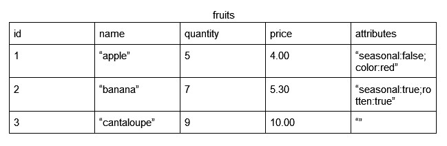

# Databases

In this session, we will be talking about at a high level, how to work with databases in a backend server.

## TL;DR

## Read More
There are primarily two types of databases: **SQL** and **NoSQL**.

### SQL Databases
SQL (Structured Query Language) databases are characterized by being structured in tables. Every row in the table represents an entry of data, organized by the columns. 



Each column can have different types, such as integer, string, float, date, etc. However, everything in one particular column must have the specified type. They also don't have a map or dictionary type. To get that same effect, you can serialize the map into a string, as seen in the "attributes" and deserialize once you retrieve the data. 

## SQL Query
To retrieve, add, modify, or delete information from SQL databases, you perform SQL queries. These can be performed in the console connected to the databases.

Here's an example of a basic query retrieving some data from our table above.

```SQL
SELECT * FROM fruits
WHERE quantity < 5;
```

This query asks for all entries in the `fruits` table where the `quantity` field is less than 5. It asks for all the columns that these rows have. To query for only certain columns of the rows:

```SQL
SELECT name, price FROM fruits
WHERE quantity < 5;
```

You can learn more about SQL queries [here](https://www.w3schools.com/sql/).

### NoSQL Databases
NoSQL databases are structured into documents. Each document is similar to a JSON object, where you have a set of fields and values. A document can have missing fields, but each document in a *collection* must have the specified value type for a particular field.

The values could be of different types like integer, string, dates, etc. They can also be maps! As such, NoSQL allow for much more flexibility.

For the same data that is in the table above, we can store them in NoSQL as such:

```JSON
{
    "id": 1,
    "name": "apple",
    "quantity": 5,
    "price": 4.00,
    "attributes": {
        "seasonal": false,
        "color": "red"
    }
}
{
    "id": 2,
    "name": "banana",
    "quantity": 7,
    "price": 5.30,
    "attributes": {
        "seasonal": true,
        "rotten": true
    }
}
{
    "id": 3,
    "name": "cantaloupe",
    "quantity": 9,
    "price": 10.00,
}

```

Notice how for attributes, we're storing a map and how we can have different fields in it. Furthermore, the last document doesn't have attributes at all.

You can play around with NoSQL [here](https://www.mongodb.com/nosql-explained).

Choosing which type of database to use depends on your usecase and what is required. 

### Firestore in Go
These days, generally backend frameworks will have libraries with wrappers around queries.

The editor backend uses Firestore, so [here's](https://cloud.google.com/go/docs/reference/cloud.google.com/go/firestore/latest) the documentation and brief tutorial on how to use Firestore with Go.