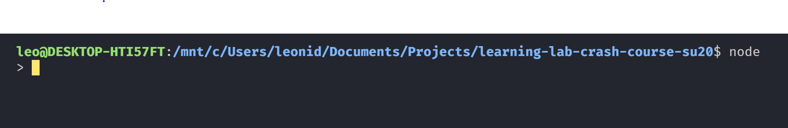

# Intro to React
Welcome welcome :) we are super excited for you to be here! In this first session, we will be going over:
- Review of Git (as needed)
- Intro to Node
- Intro to NPM/NPX
- Intro to React
  - Create React Project
  - JSX Intro

## Review of Git
[Git-it](https://github.com/jlord/git-it-electron ) is a super easy to use desktop app that helps you learn git if you need more resources!
- git init
- git clone <url>
- git branch <branch-name>
- git checkout <branch-name>
- git pull <origin-name>
- git merge <branch-name>
- git diff 
- git add <files>
- git commit -m <message>
- git push

## Node Intro
### What are Node and NPM and Yarn?

Nodejs is a runtime that brings JavaScript code out of the browser and into your hardware. This enables a wealth of possibilities, as JavaScript code suddenly is enabled to interface with common I/O operations and user-level applications!

So when you hear “application on Nodejs”, Nodejs isn’t a framework, it’s a runtime environment! Generally when you hear that people are saying it’s NodeJS, they also mean that the framework that they are using is Express! But you’ll learn what the difference is in the future :)

There's a difference between runtime environment (like JRE, the java download) vs framework (it tells you how to use/where to use) vs library (you tell it what to use/where to use, sorta like Math in C++)

NPM stands for **Node Package Manager**. This is the tool used to manage package installation and dependency for Node applications. It has a registry of over 1.3 mil packages at its disposal.

Yarn is also another package manager. This is what we will use for teachla! The reason why we use this is because it's much faster, and carries some security benefits:


### How do I install Node (and Yarn)?

You can install Node and NPM from a single installer that you can find at the [downloads page of nodejs.org](https://nodejs.org/en/download/). If you're on a *nix operating system, then things depend on your flavor's primary package manager. You can find installation guides for all kinds on the same page.

Installed with defaults, this will install **both nodejs and npm**.

To install yarn, run
```
npm install --global yarn
```

### How do I use node?

Easy enough! Just open up a terminal on your computer and run the command `node`. If it is installed properly, you should be presented with a console:



Now, we can run any piece of JavaScript code that we might want to from within the terminal:


### How do I use Yarn?

Yarn (or NPM) is a slightly different story. It is a command that is used to control dependencies of certain packages on other ones.

First, to initialize a package in your current directory, you can use `yarn init`. This will lead to a number of questions about what the name of your package will be, the author information, license, and the like. Here's example output of initializing a package in `modules-demo`:

```sh
yarn init v1.22.5
question name (teach-la-dev-training): test
question version (1.0.0):
question description: some info!
question entry point (index.js):
question repository url (https://github.com/uclaacm/teach-la-dev-training.git):
question author (ACM TeachLA <acmteachla@gmail.com>):
question license (MIT):
question private:
success Saved package.json
Done in 28.27s.
```
`package.json`:
```
{
  "name": "test",
  "version": "1.0.0",
  "description": "some info!",
  "main": "index.js",
  "repository": "https://github.com/uclaacm/teach-la-dev-training.git",
  "author": "ACM TeachLA <acmteachla@gmail.com>",
  "license": "MIT"
}
```

To add a dependency to our package, we simply find the name of the package, say, `bulma`, and install it with: `yarn add bulma`. This adds the dependency to our `package.json` that we just generated with `yarn init`.

#### Global installation

You can also install packages to use natively in your own terminal with `yarn install -g <packagename>`, where `-g` means **global**. If you're on Linux, you will likely have to use `sudo yarn install -g`.

### What is NPX? How is that different from Yarn/NPM?
You'll likely see NPX often in your web dev times as well! Here is the main difference:
- yarn/npm is a tool mainly used to install packages. <node package manager> 
- npx is a tool to execute packages. <node package executor>
So if you want to execute a package (without installing it on your computer) and then launch it you can use npx directly.`

EG, `create-react-app` is an utility to bootstrap a react project: if you use it with npx ( `npx create-react-app my-app --template typescript` ) you will have your my-app project in place.
Compare this with npm where you would need to install create-react-app itself (which will need another passage: `yarn add create-react-app` and `create-react-app my-app --template typescript`)

## So what is React? Why is it so popular?

React is **a library for building user interfaces. It is declarative, component-based, and "learn once, write anywhere"**. Here's what all those terms mean:
* **declarative**: your code is free to *describe* what it does, rather than implement every little detail. Think of it as the difference between writing HTML and writing C++.
* **component-based**: your interface will be compartmentalized into discrete components.
  * This makes life easier for us down the line, since our code will be far more maintainable. Imagine if Facebook kept all it's interface code in a single HTML file!
* **"learn once, write anywhere"**: your code will work regardless the other technologies you use. Additional features are painless.

### But why is it so popular?

Sure, there are other libraries out there like Vue and Angular (or Svelte), but React has amassed insurmountable popularity primarily because of one feature that it brought to the table:

**React only updates what needs to be updated**

Allow me to reiterate this. This is the thing that made React so popular:

**React will only update what needs to be updated in your interface**

What this means is that if you are running something that handles a ridiculous amount of data, like [Open MCT](https://nasa.github.io/openmct/), every time a new piece of data comes in, you don't have to update every single element of the interface.

Of course, it always helps when your technology is built by Facebook and open-sourced, as well.

## Why are we using typescript?
Typescript is a superset of JavaScript that has optional typing and compiles to plain JavaScript.


Here are some benefits of typescript!
- IDE assistance (like autofill)
- Catch errors early
- Faster development cycles

We'll go over how to use typescript in future lessons.

## `create-react-app`

`create-react-app` is a tool made by Facebook that **bootstraps** (see: sets up) a package with handy scripts, all the dependencies you need, and a sample app for you to get started with! All we need to do to create our app is run:

```sh
npx create-react-app <folderName> --template typescript
```

Once this runs, you'll create a new package with all the dependencies for a react app already installed, and a handful of scripts to run, test, and build your app at your disposal. More specifically,
* We can serve the project locally with `yarn start`
* We can build the project for production with `yarn build`
* We can run any tests we have written with `yarn test`

You can take a look at (and edit!) the package.json dependencies, scripts, and linters!

Let's run the demo. Change directories into the folder we just made, and run `yarn start`. This will begin serving the application on a development server so that we can see what the app looks like at present.

You should get a page that looks like:


Let's investigate how this all works.

## Understanding the `create-react-app` demo

Well, judging by the fact that the webpage tells us to "Edit src/App.tsx and save to reload.", why don't we do just that?

Navigate in your package folder to [src/App.tsx](src/App.tsx). Once in, we can see what it is that React wants us to edit:

```ts
import React from 'react';
import logo from './logo.svg';
import './App.css';

function App() {
  return (
    <div className="App">
      <header className="App-header">
        
        <p>
          Edit <code>src/App.tsx</code> and save to reload.
        </p>
        <a
          className="App-link"
          href="https://reactjs.org"
          target="_blank"
          rel="noopener noreferrer"
        >
          Learn React
        </a>
      </header>
    </div>
  );
}

export default App;
```

Pretty short and sweet! If we change something in the file, we can see that the webpage on our browser will automatically reflect our changes. So what does this demo tell us?
* We can return HTML as easily as anything else.
* We can import CSS files and others - not just TS - to our code.
  * Notice we import `./App.css`, and its styles are applied to the component.
  * Notice how we import `logo.svg` as `logo` and then use it later as a value: `src={logo}`.
* Some of our HTML properties exist under a different name.
  * `class` becomes `className`, for example.


### HTML in TS: TSX

The first thing that we mentioned is one of React's great parts. This is something called Typescript Expression - TSX(JSX). It allows us to pass around HTML as easily as anything else in React.

If we are passing it around, though, it needs to all be contained in a single container tag. Notice how our return statement up above wraps it in a `<div>` tag?

In any case, let's change up the structure a little bit by adding in an `<h1>` tag:

```ts
// ...
      <header className="App-header">
        
        <h1>Hello</h1>
        <p>
          Edit <code>src/App.tsx</code> and save to reload.
        </p>
// ...
```

Better yet, let's try adding in the header tag but use a variable:

```ts
// ...
function App() {
  const greeting = "Hello";

  return (
    <div className="App">
      <header className="App-header">
        
        <h1>{greeting}</h1>
// ...
```

This is where things get interesting. We can intersperse Typescript results throughout our TSX by encapsulating them with curly braces. In this case, we used a variable, but we can use any output we wish. Consider using a function, for example:

```ts
const extraSomething = (g) => { return g + 'extra';}
...
<h1>{extraSomething("something")}</h1> 
...
```

This takes our constant `greeting` and appends `'extra'` to it.

A common pattern you'll see in JSX/TSX is use of ternary:

```js
<h1>{greeting ? greeting : 'hello'}</h1>
```

If the value `greeting` is truthy, then it will be returned. Otherwise, 'hello' is returned. This is handy for dealing with values we might not be sure exist.

### Including other files

We can include other files in our React components very easily through `import` statements, just like ES6 modules.

Typically for a React component, this means that we style our JSX through a CSS file. In the case of our App component, this is `App.css`.

# Additional Resources
## Node, NPM
* [tutorialspoint's piece on "What is Node?"](https://www.tutorialspoint.com/nodejs/nodejs_introduction.htm)
* [How to publish your own package to NPM](https://docs.npmjs.com/packages-and-modules/contributing-packages-to-the-registry)

## React
* [React's official guide to getting started](https://reactjs.org/docs/getting-started.html)
* [React docs on the React.Component interface](https://reactjs.org/docs/react-component.html)
