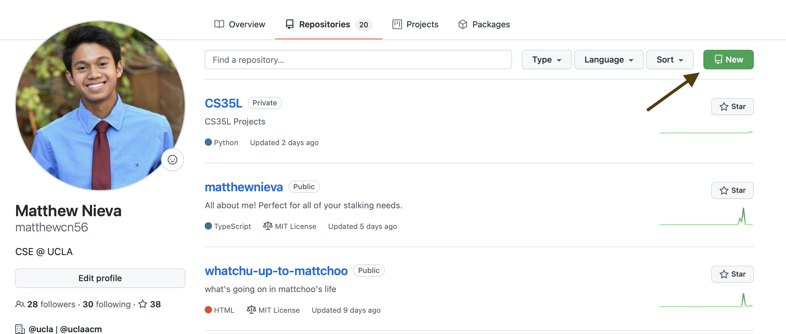

# Github Workflows and Intermediate CSS

Now that we've looked at how plain HTML/CSS works, let's take a look at what git/Github is and how we can get started working with the TeachLA website!

## Table of Contents

- [Git vs Github](#git-vs-github)
- [Link To Previous CSS Writeup](#link-to-previous-css-writeup)
- [Personal Project](#personal-project)
- [Github And Github Pages](#github-and-github-pages)
  - [Making a Repository](#making-a-repository)
  - [Hosting on Github Pages](#hosting-on-github-pages)

## Git Vs GitHub

[Git](http://git-scm.com) is a version control system that lets people collaborate on different projects together. TeachLA and ACM as a whole use it to keep track of our code, so let's take a look at its three main features!

- Backing up your code so that other people can use it in the future, like Google Drive
- Keeping a history of all the changes you made to your code, like Google Docs Edit History.
- Collaborating with people without messing up code through Google Docs.

On the other hand, GitHub is a tool that utilizes git, allowing people to do a lot of extra features on top of github like:

- making sharing/collaborating code with others easiers
- letting you automatically test code with Continuous Integration/Deployment
- Hosting websites with github pages

and a lot more!

We'l go over the rest in a bit more detail but you can check out our TeachLA environment set-up [tutorial](https://teachla.uclaacm.com/docs/dev-setup) to get your TeachLA's website set up on your local machine!

## Link to Previous CSS Writeup

For a detailed guide of what we'll discuss today about CSS, take a look at the previously made [writeup](https://github.com/uclaacm/learning-lab-crash-course-su20/tree/main/02-intermediate-css)!

## Personal Project

Now we should have all the steps needed to continue working on our personal websites! Try making a repository for it, adding more content/CSS to it, and deploying it on GitHub Pages!

## Github and Github Pages

Now that you've started making your own website, it's time to host it online so that other people can see it! Let's utilize GitHub and GitHub pages to do just that.

### Making A Repository

To make a repository, you can go to your github account and press the **New Repository** Button on the top right.

Once you're there, you can follow the instructions as provided to have the source code for your website up for the world to see.

If you want to provide a description of what your website is about, you can also do that by making a README.md file which uses the [markdown](https://www.markdownguide.org) language and is what this file you're reading is written in!

### Hosting on Github Pages

To make your website available to the public, you can go to the settings menu and go to the pages section to generate a URL for people to go to the website you just made!

You can view an example of the site we just created [here](https://matthewcn56.github.io/teachla-owo/), and the repository linked to it [here](https://github.com/matthewcn56/teachla-owo).
