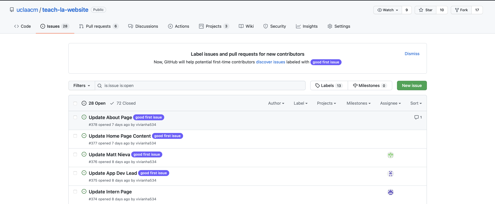

# Github And Jekyll

Today, we'll go more in-depth with how to use Github to collaborate on projects and how we can use static site generators like Jekyll to make websites!

## Table Of Contents

## Gitting Into Git

Last week, we covered how we could use git to clone into repositories in order to grab source code from other people.

This week, we'll cover how we can use Git to collaborate on large projects with people, and the cool features that come with it!

## Making Changes

Now that we've covered [how to "pull" code](https://github.com/uclaacm/teach-la-dev-training/tree/main/intro-to-web-dev/03_flexbox_grid#getting-example-code-with-github) from other repositories through the `git pull`, let's talk about how we can make changes and get started on collaborating!

### Github Issues

The [Issues](https://docs.github.com/en/issues/tracking-your-work-with-issues/about-issues) tab of a repository is used to organize work within a project, and is a way to view a lot of the work that needs to be done on a project.



Within an issue, you can view an overview of what needs to be done and a list of labels associated with it! If you feel like you want to tackle a problem, you can contact someone who's in charge of or a "maintainer' of the repository, and they'll assign an issue to you!

[anIssue](./images/anIssue.png)

### Branches

If you click on the [branches](https://docs.github.com/en/github/collaborating-with-pull-requests/proposing-changes-to-your-work-with-pull-requests/about-branches) section of a repository, you can see a list of a bunch of different versions of the code within the repository. Branches are a way for you to work on a new feature in isolation of all of the work that other people may be doing on a project at the same time!

The most important one is the "main" or "master" (default) branch of the repository.

### The Main Branch

The main branch is the one that is displayed whenever someone visits your repository, or the initial one when someone clones a repository.

### Checking Out And Making New Branches

For TeachLA's website, whenever you make a change and want to see it reflected on our "deployment" or how you can view teachla.uclaacm.com through a URL, you should merge changes into the main branch.

In order to isolate your work from other people's work, you can check out a new branch to look at your changes! If you're a collaborator on a repository (which you are if you accepted the ACM@UCLA github invite email!) you are able to make a new branch and start working on a change right away.

(If you are not a collaborator for a repository, you'll have to [fork the repository](https://docs.github.com/en/get-started/quickstart/fork-a-repo) instead of creating a new branch directly!)


To see a list of all the branches that
The way that you can make a new branch is by running the

```sh
$ git checkout -b NAME_OF_BRANCH
```

command!
Let's break down what this command does. Git checkout tells git that you want to switch the version of code you are looking at to the one that's contained within the other branch, and the -b command tells git that you want to create a new branch taht hasn't existed yet.
