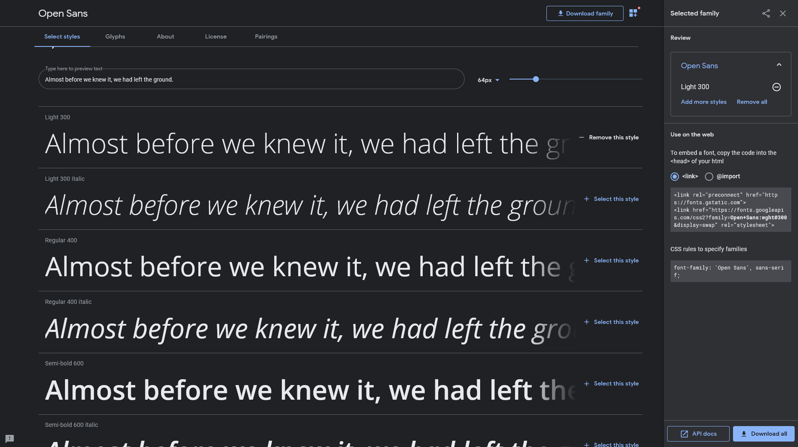

# Introduction to CSS

In this session, we'll be going over how CSS can make your website pretty and some common CSS properties to know by heart.

## Table of Contents
- [Lesson](#lesson)
- [Project](#project)

## Lesson
Continuing on from last week, read about CSS from the same [writeup](https://github.com/uclaacm/learning-lab-crash-course-su20/blob/master/01-intro-html-css/README.md#styling-with-css) by Matt and Leo. Keep in mind there are *a lot* of CSS properties, and it's not worth your time to memorize all of them. Often you can just Google what is is you are trying to achieve or read documentation from [MDN](https://developer.mozilla.org/en-US/docs/Web/CSS) to see what a specific property and values do. The main ones to know include (not an exhaustive list):
- background
- border
- color
- cursor
- display
- float
- font-family
- font-size
- font-weight
- height, width
- margin
- opacity
- padding 
- position
- top, right, bottom, left
- visibility
- z-index

Similarly, for selectors, you really just want to get down the basics of selecting classes and IDs. `:hover`, `:active`, and `:focus` are good to remember as well, but others are less common due to the use of classes and Javascript. 

### How to Use Google Fonts
Sans-serif might be classy and all, but maybe you want a font that's a bit more modern and stylistic for your webpage. How can you use it? One easy way is with [Google Fonts](https://fonts.google.com/). Google Fonts has over a thousand different fonts for you to choose from. You can select a couple that you'd like to use and import it in your website. 

Suppose that I want to use Open Sans on my website. I would go to the [page](https://fonts.google.com/specimen/Open+Sans) for the font family, choose the font styles I'd like to use. Note that you need to select all the ones that you plan to use, if you plan to change the font weight or add italics or bolding. 

You have two options of importing this font. You can use the `<link>` tag in your HTML file, by copying the code box in the panel to the inside of your `<head>` tags. Alternatively, you can use `@import` in your CSS file. To do so, select the `@import` radio button and copy the code in the box starting from `@import` to the semicolon. Put this line at the top of your CSS file, and you've imported the font. To actually use the font, just specify the font name in the `font-family` property. 

### Next Up
We'll talk about padding, border, margin, display, position, float, and flex more in detail next week, since there's some nuances that might not be apparent! They're often what makes CSS the most challenging, since we often need to make sure the website looks good across all sorts of devices. By more on this later (Feel free to use them in your project though!). We'll also talk about how to use CSS animation to make our website have variety later as well! 

## Project
Now that we've learned about CSS, let's use it to prettify our website! Use it to your advantage to make your name nice and big, or make your navbar spaced out just right. If you've got a particular vision in mind for a feature but don't know how to go about it, try Googling it! Stackoverflow and Codepen has a lot of example code on how to make CSS work. 
