# Designing with Figma

NOTE: This writeup is largely based off Karen's Figma workshop. Thank you Karen!

## Table of Contents

* [Planning](#planning)
  * Mood boards
  * Color
  * Fonts
  * Style guides
  * Common web layouts
    * A note on responsive design
* [Creating a wireframe](#creating-a-wireframe)
  * Frames and presets
  * Shape tools and pencil
  * Auto layout and alignment
* [User experience + accessibility](#what-makes-good-design) part 1
  * Readable body text
  * White space!
* [Basic prototyping](#basic-prototyping)
  * But first, components
  * Connections
  * Preview
* [Accessibility](#accessibility)
* [Today's Plan](#todays-plan)
* [Further reading](#sources-and-further-reading)

## Planning

You might already have a very clear idea of what you want your design to be, or you might not. My hope is that these next few tips will be helpful, regardless of where you are in the planning process.

### Research and mood boards

It's good to see what's already in the field. A product is much easier to use if it follows the "unspoken rules" of similar products in the same field—often because the rules are based on years of refinement. 

Of course, there's a balance to strike here between outright plagiarism and radical creativity. 

This [video](https://www.youtube.com/watch?v=4OL9jXLOtBw) is one of my favorites! It discusses how to use references effectively and without plagiarizing. It’s more oriented towards animation, but the step-by-step process it describes can be applied to web design as well. I’ll sum up what it says below:

Start by listing out the necessary elements in your page. Sometimes, this will be provided already in the form of a barebones website but sometimes you’ll be coming up with it on your own! This stage could also include a very rough thumbnail sketch.

Look for references! Identify what specifically you like about each image and what all your images have in common. Is it the colors? The illustrations? The layout? This will help prevent outright plagiarism. 

Below, I’ve listed some common websites to find web design inspiration. However, challenge yourself to look for inspiration more broadly, whether it be from other mediums of art or just in your life! As you can tell from the video above, I like to take inspiration from animation.
* Pinterest
* Behance
* Dribble

### Color

Next, we can start choosing some colors. You can use colors from your mood board, colors that are part of your organization's brand, or come up with something new.

To add interest while keeping things from becoming too chaotic, we can come up with a color scheme.

There are many different ways to approach color schemes but this is how I would do it:
* Pick a neutral
  * Often, this is just black or white. However, pure black and white can be harsh on the eye. Experiment with using a very dark grey or a very light cream!
* Pick a main color
  * Your main color might be something commonly associated with your field. For example, blue is often associated with efficiency and trustworthiness, and green is associated with nature and money.
  * The main color makes up 50-70% of the elements that have color.
* Pick 1-2 accent colors
  * This is where the color theory (and the creativity) comes in! For example, if your main color is green, we could choose two more shades of green. Or, we could choose red as a complementary color, or maybe even yellow and purple as a triadic color scheme. You don’t need to worry about the fancy words; just experiment until you find something you like. 
  * One accent color can also serve as the call to action color. This will mark interactive or important elements, such as links, buttons, and/or headings.

Important! When choosing colors, less is more. You can create a beautiful design with just two colors if you wanted, but once you start to get above 5 colors, it starts to get a bit muddy. Of course, this is not a hard-and-fast rule, but when starting out it’s best to keep the colors minimal.

Here are some details about color theory if you’re interested. However, it is perfectly okay to use premade color palettes.

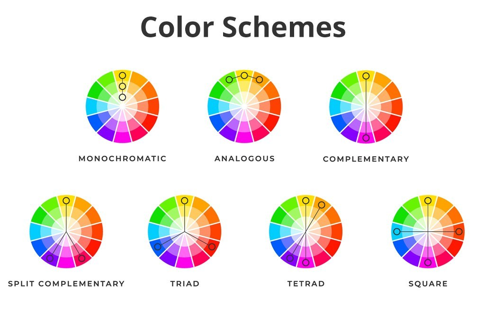

### Fonts

Just like we create a color palette, we also create a “font palette”. Like the colors, less is more. Try to stick to no more than 3 fonts per project: a title font, body font, and an optional accent font. We should also specify the font sizes for the title and body. As a general rule, body font sizes should be no smaller than 12 pt and ideally around 16-18 pt. 

Here are some names of font types that could be helpful when searching for what “vibe” you want.

### Style guides

When we have a better idea of what we want, we can start to collect all of our elements in one place. An important tool for designers is the style guide. Style guides are often informal if your product is small, and it can be a work-in-progress that is developed as you work. Still, style guides are a good place to store design elements that you'll come back to again and again, such as colors, fonts, and, as we'll cover later in this workshop, components.

Storytelling and consistency go hand-in-hand. If you visited a website with five different fonts, eight different colors, and no consistent font sizes, you'd think they were pretty unprofessional. The overall experience would also be confusing and overwhelming.

So when you know you want something to stay consistent throughout, make a note of it on your style guide. This will be helpful to you, to your collaborators, and to developers.

Check out the [ACM Style Guide](https://design.uclaacm.com/guidelines/) for an example!

Now that we have a plan for our aesthetics, how are we going to arrange the content on our page?

### Layouts

Layout is primarily about organizing information in a way that makes sense. Let's say that we're making a learning lab. We've got the project name, some mini games, and we need to provide some way for

Let's have a look at some popular layouts.

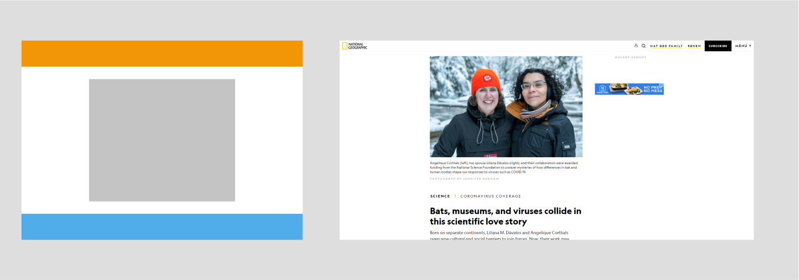

**Single-column** 

Single-column design is probably the most popular design because it is so simple. You can take this literally, by having all of the content on your entire website on one column&mdash;but you might find that you need to split up the content into multiple pages, especially if you have a lot of content. 

In that case, each page itself can still have a single-column layout, if you want.

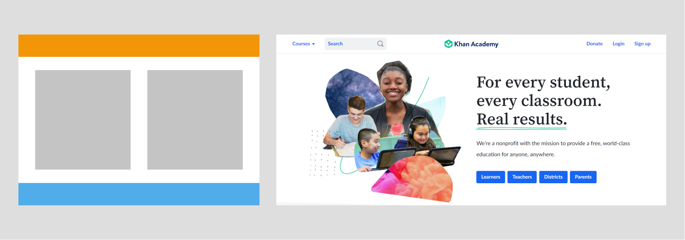

**Multi-column/Split**

However, you might find that you want some content side-by-side on the same page view. Maybe you find the content to be equally important, and that one shouldn't come before the other. In that case, try a multi-column, or split design.

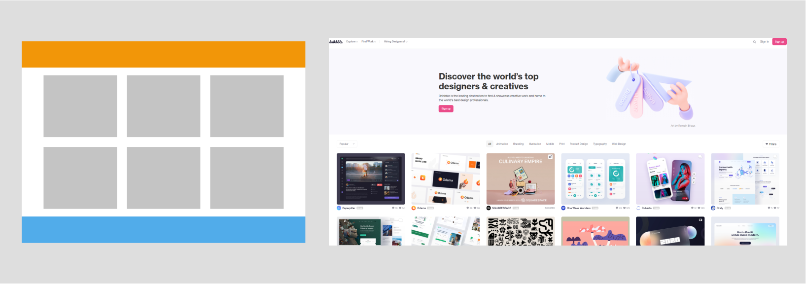

**Cards**

Sometimes you have a lot of the same type of thing that you want to offer the user as choices. That's where cards come in.

**Sidebars**

Finally, many designs have a static sidebar containing links on the right- or left-hand side, with the main content filling up the rest of the screen.

Many other designs are combinations or variations of these four basic designs.

#### A note on responsive design

The reality is that most websites today are visited on the phone.

If you're making a mobile app, you probably won't need to worry about how things look on the desktop, and ditto if you are making a complex interactive website that you don't expect people to visit on their phones.

However, most webpages, especially informational webpages about products, or apps that are designed to run on desktop and mobile, will require you to think about **responsive design**. That means that your content should, at the minimum be able to resize to desktop or mobile sizes while retaining all functionality.

Many designers today use the "mobile first" philosophy, meaning that we try to make a fully functional design using a mobile layout *before* thinking about desktop layout.

This makes sense, since at the mobile level, design real estate is *much* more limited, and it's easier to adapt something constrained (mobile) to something less constrained (desktop) than the other way around.

For the first iteration of our learning labs, we're not going to worry too much about responsive design. However, this is a good design concept to keep in mind for future projects.

## Creating a wireframe

Finally, we get to use Figma. Press `F` or select the Frame tool from the menu bar and click on your workspace to create a frame. On the right side, in the options panel, you'll find that you can click on the Frame dropdown menu and choose a preset size.

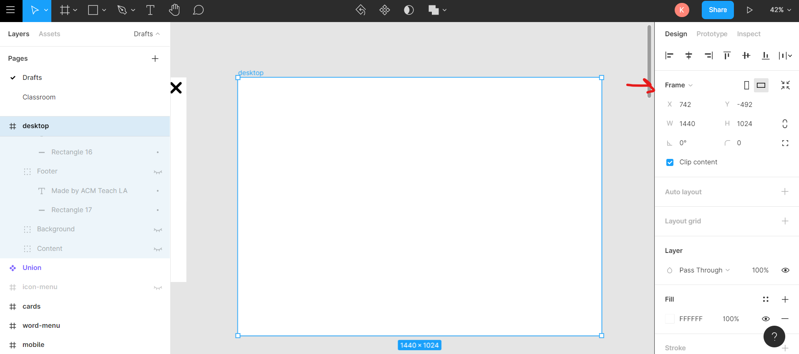

I'm going to choose the Desktop preset.

Now, we can start adding content. Use the Shape tools, the Text tool, and the Pencil tool in the menu bar to draw and write whatever you like. (You might have to press the dropdowns to get the tool you want.)

Fill colors and fonts can be applied from the Options panel.

You'll often want to group elements together so that they can move around together. Press `Ctrl` + `G` to group selected elements. Notice that in the layers panel, the elements appear to be "children" of a folder, which you can rename however you like.

I'll be referring to frames and groups throughout this document. Frames are kind of like fancy groups, which we'll explore more soon.

Remember that groups are marked with a dotted rectangle icon in the layers panel, while frames are marked with a hash. An indented element is the child of the nearest group or frame.

### Alignment

There are basically two ways to do layouts in Figma: automatic and manual.

Auto-layout can be turned on by pressing `Shift` + `A`. In the options panel, you'll find choices for . Auto-layout can be very convenient when you're wireframing, or when you have multiple similar elements .

It's just what it sounds like: you don't have to waste time worrying about where to put elements or what spacing to use!

Auto-layout applies only to the parent of a group. That means that layers within grouped objects won't be affected by auto-layout. To use it effectively, avoid applying it to the entire frame&mdash;use it with individual groupings of elements.

For complex and less predictable layouts, use the alignment buttons at the top of the options panel. These alignments always apply to the nearest parent frame.

## What makes good design?

Web products have two main functions: to catch and maintain people's attention (aesthetics) and to give them information (function). One cannot come at the expense of another.

**User experience (UX)**, at its basic definition, involves making sure that the products we make are intuitive and easy to use. At a higher level, it is the art of balancing function and aesthetic.

Psychology informs much of UX design. Where will a user look first? How long will they stay on a page before getting bored? Do they know that a button is clickable? These are all considered UX questions.

While UX principles are largely out of scope of this workshop, the best way to get good is to ask for feedback from your friends and family. They're quite good examples of real users!

However, the minimum requirements for good communication will differ for different users, which may not be represented by immediate friends and family. These considerations are collectively called **accessibility**, which we will discuss in a later workshop.

Successful UX design will be accessible, and vice versa.

### Readable body text

The worst designs that I see usually involve unreadable text. Remember when I said that there are some rules that you really shouldn't get creative with? Well, anything to do with body text (that is, the main content of your page, such as an article or blog post) should not be messed with.

(Not to name names, but Wikipedia and art school websites are common culprits.)

For example, something that I would not want to read:

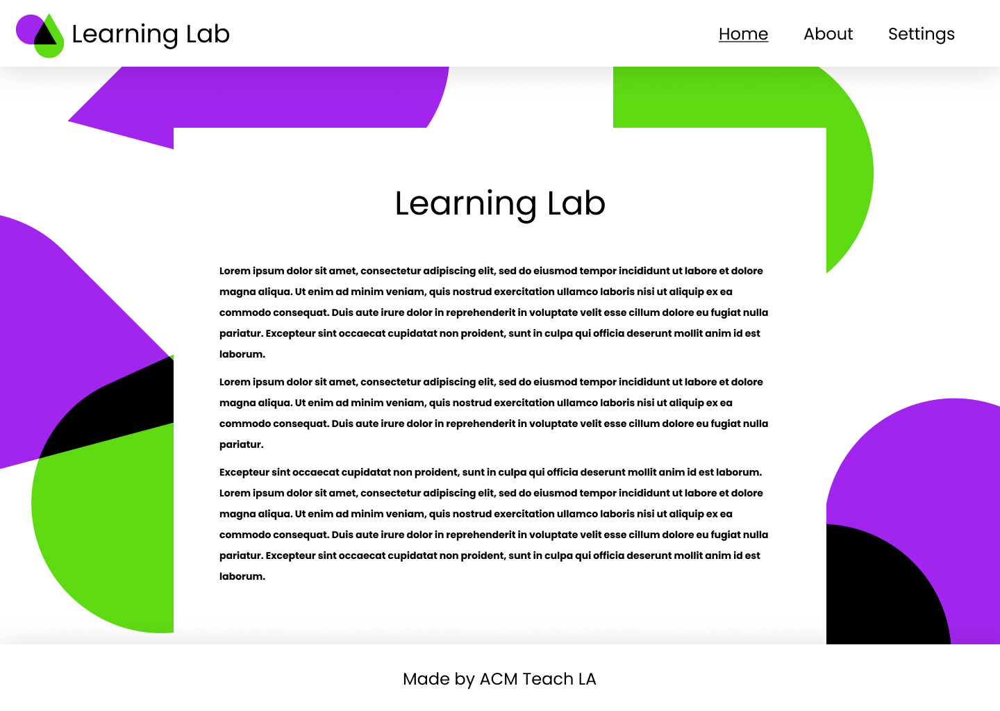

Books are printed the way they are for a reason: they provide an incredibly comfortable reading experience. News sites are some of the best examples of readable text, because their entire business model is based off of readability.

Here is an example of the same text, with print-like formatting applied.

My criteria for readable body text therefore include:

* 15-20 words per line
* Sans-serif or serif font
* High-contrast such as black on white (dark mode, while popular, actually strains your eyes.)
* At least 18pt font for desktop, 20pt for mobile
* Around 1.5 leading (line spacing)

### White space

You'll notice that many of the above guidelines revolve around having a ton of negative space in the design. "Designs need room to breathe" is a quote I remember from somewhere.

White space can be used to bring out an important piece of text (see the Apple website below), by using the contrast between empty space and, well, not-empty space.

As the Apple website illustrates, just because we have a lot of "screen real estate" does NOT mean that we should fill it up. Users become psychologically overwhelmed if we give them too much information at once. Simpler is usually better&mdash;with that being said, though, simplicity does not have to come at the expense of aesthetics.

And again, consistency is also important in spacing.

The left image below shows a spacing (often called gutters in print publishing) of 50px between elements, while the right image has no set spacing at all.

## Basic prototyping

Prototyping refers to making a version of your app or website with interactive components. After this section, you should be able to make clickable buttons and links that lead to new pages in your prototype, allowing developers to get a better sense of the functionality of your vision.

### But first, components

Components are central to Figma. Consistent, reusable components are a win-win-win: they're ultimately easier on you, on developers, and on users.

Let's say we want to make a few cards on the landing page for our activities. Draw a square, and add some text calling it Activity 1. Select these elements and press `Ctrl` + `Alt` + `K`. You just created your first component!

`Alt` + drag this component to duplicate it. Notice that in the layers panel, the component has a purple icon with four diamonds, but the duplicated **instance** has only a hollow diamond. This means that the instance will live-update to match the parent component.

Try it out: change the font size of the parent, or the color. The instance immediately updates to match. However, it doesn't work the other way: overriding the color of an instance does not affect the parent.

*This means that if you change your mind about an element, you only have to make changes once and every page will update to match.* Components are an incredibly powerful (ie, time-saving) tool.

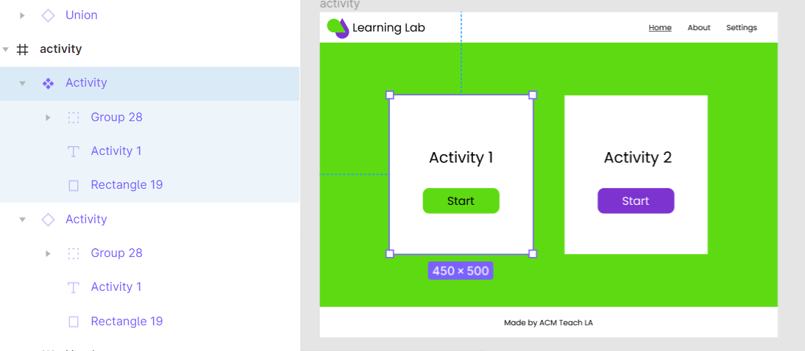

(Note: to keep content from spilling off the frame, check the "clip content" box in the options panel under the Frame section. This is what I meant when I said frames are special groups.)

*Before* you start duplicating your pages to begin prototyping, look over your design and try to predict what will be helpful to future-you. I always make the header and footer into components, as well as the background if applicable. Other elements are up to your discretion.

If you plan on reusing any piece more than once throughout your design, make it a component. It's easier to detach an instance from its parent (`Ctrl` + `Alt` + `B`) than to go through 20 pieces trying to update them all to match.

Let's make the header and footer into components now, so that when we want to make more pages for our website, we can just duplicate our home page and edit the copy, knowing that any changes we need to make to the header and footer later will be updated on all pages.

### Making connections

Okay, we're all missing that during COVID-19. But, maybe we can fill a little of that void in our lives by making some FIgma connections.

Press `Ctrl` + `D` to duplicate our main page. Add some body text (called "copy" in UX-speak). This will be our "About" page.

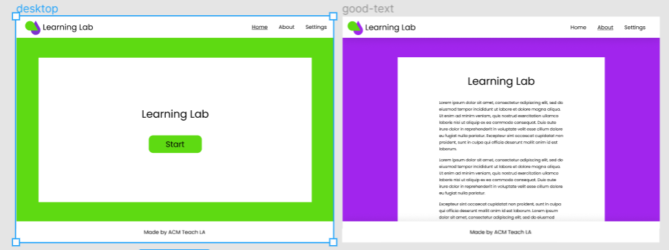

On the top of the options panel, you'll see a Design tab. Switch over to that, and click on the workspace so that nothing is selected. You'll see that there is an option to set a starting screen; set that to our Home page.

Next, in your Home page frame, select the text in the header that says About. Notice the blue node on the right-hand side of the text box.

Drag this node to the About frame until it snaps (be careful to direct the arrow to the entire frame, not any of its contents).

A pop-up should show up with many different options, although the current selections will do for our purposes. The "on click" indicates that when the user clicks the About link, the prototype will display the About frame&mdash;kind of like an interactive presentation.

You've made your first prototype connection! This should be enough to get you started with a linear flow, although Figma has many powerful functions associated with prototyping.

### Content organization

Which pages do we connect in our prototype, and in which order? This is where we have to think about content flow.

Let's return to the concept of storytelling. When a user enters your site or app, they are being introduced to a new environment. They might not quite know what they want, or they might be looking for a specific thing.

So, we should ask ourselves: how is a user going to navigate your website? Let's start by mapping out some possibilities from the pages that we plan to include. Which option below looks easier to navigate?

Generally, the more levels you have in your hierarchy, the more clicks it will take for the user to get to what they want, and the more frustrated they'll become. Again, we want to smooth the path for our users. So, in this case, the option on the left is easier to use.

However, there are instances where having 20 pages at the same level doesn't make sense. You might want to put more general pages at the first level after the home page, and use those general pages as folders to organize more specific pages.

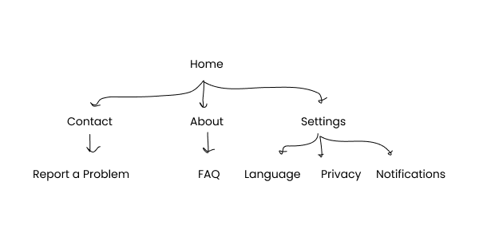

You can build content organization into your prototype by creating submenus within your menu.

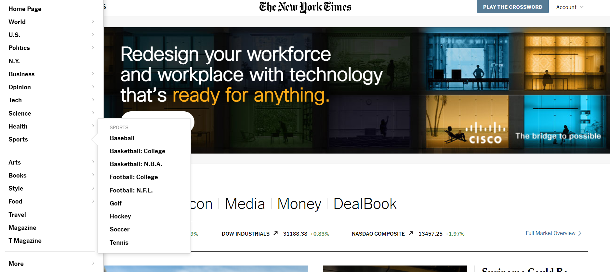

Or, you can make certain pages only accessible through links on the parent page (for example, "forgot password" should only be accessible from the "login" page).

Organizing content might take a lot of drawing and erasing, and more than a few rounds of feedback from users, but your work pays for itself in terms of user experience.

### Nice work!

You now have a basic prototype! Press the Play button at the top right of your workspace to preview your prototype. You can send this link to others for a high-level overview of the project.

As a final note, the Inspect tab next to the Prototype tab is useful for developers.

## Accessibility

We don’t have time to cover accessibility in detail today, but check out [Karen's readme](https://github.com/uclaacm/tla-dev-intern-training-w21/tree/main/week-9-accessibility-best-practices) if you’re curious! Here are some main points

* Use this [website](https://webaim.org/resources/contrastchecker/) to check that your colors have enough contrast.
* Line height at least 1.5x as large as our font size.
* Make sure your website is still usable when zoomed in.
* Use alt text for your images.
* HTML should represent the structure of your page. If you remove all the CSS, your page should still make sense.
* Autoplay animations and videos are not great!

## Today's Plans

### Create a Style Guide

#### References

In the interest of time, we’ll use some references I found already. Here are some of the images that came up when I searched “food web design.” What do they have in common? What do you like about each?

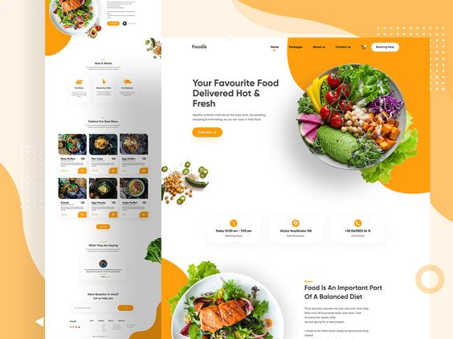

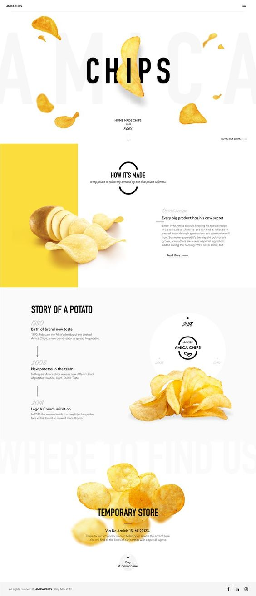

#### Colors

This website is pretty simple so let’s stick with three colors. Let’s also practice using our references. 

For our neutral, do most of our references use a light or dark scheme? What main colors do you notice? What accent colors?

#### Fonts

Okay now that we have our colors, let’s think fonts. Which type of fonts do you notice in the references? Since our website is pretty minimal, two fonts should be enough. Also for the sake of time, here’s a list of [Figma font combinations](https://www.figma.com/file/4NKB25zt7rM0y6sVPM1UW7/Figma-Font-Pairings-(Community)?node-id=0%3A1). Feel free to mix and match!

### Now Figma

#### Frames

Frames are special types of groups that basically represent your screen. For our purposes, we will only need the Desktop and Mobile frame.

#### Basic Tools
##### Top
* Along with the frame tool, here we also find our shape tool and pen/pencil tool. 
* Once we make a shape, we can edit it by double clicking. The bend tool lets us make some cool shapes!
* Press shift to make a square aspect ratio.
* The play button at the top allows you to see a real-life view of your website! Choose the “fit to width” option. I highly suggest you have this open in another tab while you’re designing. 

##### Left

Here are our layers. We can see our different groups, frames, and even pages! We can also lock and hide elements on our page.

##### Right

There are three tabs here but the most important one is “Design”
* Here we can align items, change their color, add stroke or effects, and access text properties.

The inspect tab is also useful for converting your design to CSS.

#### Components
* Groups are cool, but what if we wanted to have a lot of the same stuff? If I decide to change the color, I want to change it just once, not for every single group. That’s where components come in. 
* Changing the parent component will change the child component. The reverse is not true.
* You can also “detach” a child component from its parent.
* NOTE: press alt to duplicate, double click to enter shape

## Sources and further reading

* [Web layouts (Nick Babich/Adobe XD)](https://xd.adobe.com/ideas/principles/web-design/11-website-layouts-that-made-content-shine-in-2019/)
* [Content organization (Lauren Hooker/Elle and Company Design)](https://www.elleandcompanydesign.com/blog/organizing-content)
* [Color theory (Christian Vizcarra/UX Collective)](https://uxdesign.cc/all-you-need-to-know-about-colors-in-ui-design-theory-practice-235179712522)
* A really cool feature we didn't have time to cover today: [Constraints](https://help.figma.com/hc/en-us/articles/360039957734-Apply-Constraints-to-define-how-layers-resize)

### A note on keeping up

As you know, things on the web are never permanent. To keep up with the trends, I recommend just staying aware of changes that are happening around you. As you're browsing the web, ask: Why did Google change their icons again? What does the new iPhone look like?

Additionally, the Community tab on your Figma home page is a great place to find neat things that the community is creating. (Similar sites include [dribbble](https://dribbble.com) and [Behance](https://www.behance.net).) You can also find inspiration from artists working in other media on Instagram, Pinterest, and more.

For skills- and feature-related tips and tricks, Figma recently changed the location of their community forum from [Spectrum](https://spectrum.chat/figma) to the [Figma Support Forum](https://forum.figma.com/). Check it out to explore advanced Figma topics!

### Keyboard shortcuts

Click the question mark at the bottom right hand corner of your workspace and click Keyboard Shortcuts for a full list. These are the ones that I use every day. They will save you literally hours.

| Shortcut                  | Function                                                     |
| ------------------------- | ------------------------------------------------------------ |
| `K`                       | Select scale tool (resizes objects proportionally)           |
| `C`                       | Select comment tool                                          |
| `V`                       | Select mouse tool                                            |
| `P`                       | Select pen tool                                              |
| `Alt` + `Enter`           | Post the current comment                                     |
| `Alt`                     | Press when resizing or drawing to draw from center. Press before dragging to duplicate |
| `Shift`                   | Press to resize proportionately, to draw regular polygons, or to snap lines and anchors to 45-degree angles |
| `Shift` + `H`             | Flip horizontally                                            |
| `Shift` + `V`             | Flip vertically                                              |
| `Ctrl` + `D`              | Duplicate in place                                           |
| `Ctrl` + `G`              | Group                                                        |
| `Ctrl` + `Shift` + `G`    | Ungroup                                                      |
| `Ctrl` + `E`              | Flatten a group of shapes into one vector                    |
| `Ctrl` + `Y`              | Redo                                                         |
| `Ctrl` + `R`              | Rename or batch rename                                       |
| `Ctrl` + `Alt` `C`        | Copy properties (fill, stroke, etc.)                         |
| `Ctrl` + `Alt` + `V`      | Paste properties                                             |
| `Ctrl` + `\`              | Toggle menu show/hide                                        |
| `Ctrl` + `Alt` + `G`      | Frame current selection                                      |
| `Ctrl` + `Alt` + `K`      | Create a component from current selection                    |
| `Ctrl` + `Alt` + `B`      | Detach instance of a component                               |
| `Ctrl` + `Shift` + `H`    | Hide/show current selection                                  |
| `Ctrl` + `Shift` + `Lock` | Lock/unlock current selection                                |
| `Ctrl` + scroll           | Zoom in and out                                              |
| `Space` + drag or scroll  | Pan around the screen                                        |
