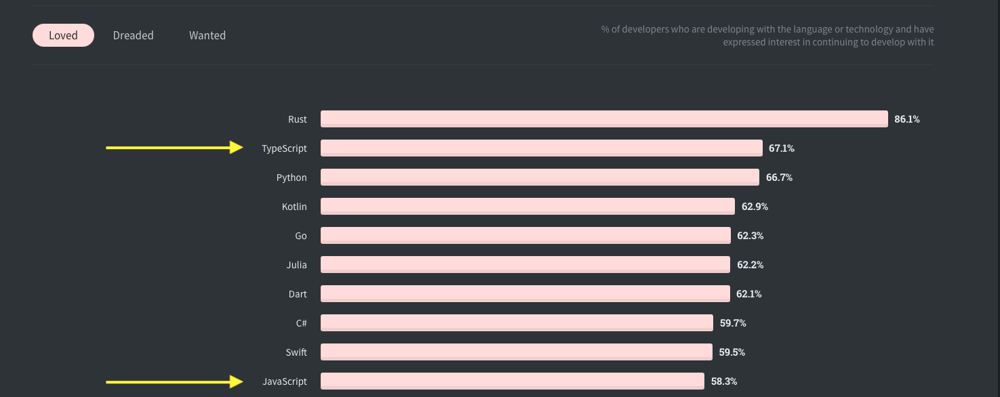
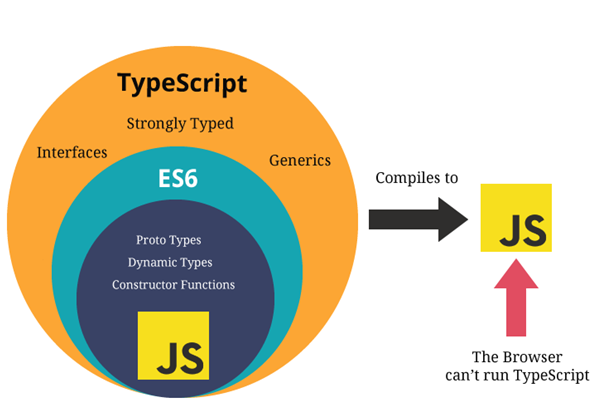

# TypeScript, My Type of Language

As a whole, TeachLA's dev-team is going over a lot of changes this year! Today, we'll go over what exactly we've been changing, why we're making these changes, and
go into more depth on how to switch!

## Table of Contents
* [Our New Template Repository](#our-new-template-repository)
    * [Webpack](#webpack)
    * [Linting](#linting)
    * [Github Actions](#github-actions)
    * [Yarn](#yarn)
        * [NPM To Yarn](#npm-to-yarn)
    * [TypeScript](#typescript)
* [JavaScript To TypeScript](#javascript-to-typescript)
    * [Common Issues With JavaScript](#common-issues-with-javascript)
        * [Wrong Function Arguments](#wrong-function-arguments)
        * [Refactoring Struggles](#refactoring-struggles)
    * [What is TypeScript](#what-is-typescript)
    * [How Does TypeScript Work](#how-does-typescript-work)
    * [Getting Started With TypeScript](#getting-started-with-typescript)
    * [Typing](#typing)
    * [Interfaces](#interfaces)
* [TypeScript In React](#typescript-in-react)
    * [Typed Props](#typed-props)
    * [Enums](#enums)
    * [Using Our Template Repository](#using-our-template-repository)

## Our New Template Repository

Our new template repository will be used as the basis for our Learning Labs, and let's take a look at all the features that it provides for us!

### Webpack
When you run `npx create-react-app`, node sets up the compiler to run your React code into your browser. We've customized our [Webpack](https://webpack.js.org) to help bundle our TypeScript and JavaScript files for browser usage!


### Linting
We use [ESLint](https://eslint.org) and [stylelint](https://stylelint.io) to help ensure that our code doesn't have problems and automatically fixes them for us as well.

### Github Actions
We have set-up GitHub Actions to automatically test our builds to see if there's any issues and lint our code as well.

### Yarn

We've changed our package manager from npm to yarn because it's a lot faster and there used to be some security concerns with npm!


### NPM To Yarn
Switching from NPM to Yarn isn't that bad, you can install yarn globally through npm with

```sh
$ npm install --global yarn
```

and there's only a few differences between the two, like how `npm start` becomes `yarn start` or how `npm install PACKAGE` becomes `yarn add PACKAGE`, etc.

To initialize yarn in your application, just run 
```
$ yarn init
```

or 

```
$ yarn init --yes
```

to skip all the prompts that appear!


### TypeScript

As you'll see in our repository, a lot of our files end in `.tsx` instead of `.js` or `.jsx` and that is because we're going to be using TypeScript over JavaScript for our code!

## JavaScript To TypeScript

Developers have a love-hate relationship with JavaScript. Even though JavaScript is the [most commonly used language in the world](https://bootcamp.berkeley.edu/blog/most-in-demand-programming-languages/), it is only ranked #10 on the most loved languages according to StackOverflow's yearly developer survey while TypeScript is all the way up to #2! 



**Why is that the case?**

## Common Issues With JavaScript
Since JavaScript is a dynamically typed language (which means that variables can change types), JavaScript fails to catch a lot of errors and makes refactoring code in the future hard.

### Wrong Function Arguments
Let's take a look at this function that divides two numbers!

```js
function divideTwoNums(a,b){
    return a/b;
}
```

If we try running our code with two arguments that are both numbers, then the function works perfectly fine.

```js
console.log(divideTwoNums(8,4));
//returns 2
```

However, if we try to pass in two arguments that are ***not*** numbers into `divideTwoNums`, we can see that some issues arise!

```js
console.log(divideTwoNums("apple","banana"));
//returns NaN
```

**Should we be able to pass in "apple" and "banana" into our function `divideTwoNums`?
**

[TypeScript's Solution Here!](#typing)

### Refactoring Struggles

Let's take a look at a function that calls a pet argument we pass in!
```js
function callPet(pet){
    return "Come here "+ pet + "!";
}
```

We can call it like so:
```js
const myPet = "Rufus";
console.log(callPet(myPet));
//Prints out "Come here Rufus!"
```

However, let's say that we want to change the structure of our pet parameter for the function `callPet` to be a pet object like so:

```js
const newPet = {
    name: {
        first: "Rufus",
        last: "the Third"
    },
    type: "dog"
}
```
Even though our code editor won't spit any errors at us when we try running `callPet(newPet)`, the application **will** crash, but the error will point us towards the function instead of where the problem **really lies**, inside the function call. 
```js
/*Our terminal tells us: TypeError: Cannot read property 'first' of undefined at callPet, even though our code editor thinks this is perfectly fine!  */
console.log(callPet(newPet));
```

This can be a **serious problem** since application crashes can be very costly for companies and we want to be able to detect our errors at the source!

[TypeScript's Solution Here!](#interfaces)

### What is TypeScript?

[TypeScript](https://www.typescriptlang.org) is an open-source language built on top of JavaScript that addresses the issues of JavaScript being a dynamically typed language by adding **static type definitions.** (types that are determined at compile time)



TypeScript is a **superset** of JavaScript which means that all JavaScript is valid TypeScript, but not all TypeScript is valid JavaScript.

### How Does TypeScript Work?


### [Compiled Vs Interpreted Languages](https://www.geeksforgeeks.org/difference-between-compiled-and-interpreted-language/)
While JavaScript is an **interpreted language**, which means that it gets read by an interpreter like a web-browser instead of compiled into machine code, TypeScript is a **compiled language** which means that TypeScript gets converted to JavaScript when you compile it, which offers a vast number of benefits!

* You can debug applications before they're being run, at compile-time.
* Your IDE can auto-fill properties of objects (with ctrl/cmd space).
* Compilation errors help reduce the chance of you making errors and help catch errors.

### Getting Started With TypeScript

Since TypeScript is built on-top of JavaScript, we're going to need to add it in our project's dependencies with:

```sh
$ yarn add typescript
```

This adds TypeScript support to our project and gives as access to the TypeScript compiler in our shell with `tsc` which we will use to run typescript commands like compiling our code and more! 

To initialize TypeScript in our application, we have to run:
```sh
$ yarn tsc --init
```

This creates a `tsconfig.json` file in the root of our current directory and allows us to customize what we want TypeScript to allow or do.

When we compile/transpile  our TypeScript code with:
```sh
$ yarn tsc path/to/file.ts
```
 it checks for errors and gets transformed into JavaScript to the location of our `outDir` within our tsconfig.json .

 The great thing about it is that it checks for type errors **before** we have to run the code and provides more thorough error messages which is amazing!

Now, let's go over some of the usages of TypeScript with some examples in small node scripts!

An In-Depth guide of learning TypeScript from JavaScript is also offered from the official typescriptlang website!

### Typing

Do you remember our [divideTwoNums function from earlier](#wrong-function-arguments)? 

Even though it expected two numbers, we were allowed to pass in parameters that were **not** numbers which gave us unintended results!

However with TypeScript's typing denoted by the `:` symbol, we **have** to declare what are the types of return values of functions and the types of the function's arguments!

Let's take a look at the `divideTwoNums` function in JavaScript:

```js
function divideTwoNums(a,b){
    return a/b;
}
```

If we were to type this in TypeScript, it would be like this:

```ts
function divideTwoNums(a : number, b : number) : number {
    return a/b;
}
```

This means that the function's parameters, a and b are both numbers, and
the function `divideTwoNums` also returns a number!

When we compile with 
```sh
$ yarn tsc tsTests.ts
```
it compiles to regular old JavaScript!

```js
function divideTwoNums(a, b) {
    return a / b;
}
```

This provides **type-safety** since we get compilation errors if we try calling `divideTwoNums` and a and b are not numbers!

```ts
/*Argument of type 'string' is not assignable to parameter of type 'number'*/
console.log(divideTwoNums("tree","chocolate"));
```

### Interfaces

Do you remember our [`callPet` function](#refactoring-struggles) from earlier?

More than just simple typing of functions with primitives, TypeScript offers us a way to describe the **shape** of parameters and return values by providing an abstraction of the parameters we pass in!

Let's take a look at our `callPet` function in JavaScript again,
```js
function callPet(pet){
    return "Come here "+ pet.name.first + "!";
}
```

If we were to turn this into TypeScript, how do we know what is the type of the pet parameter?

TypeScript is a **duck-typed** language, which means that if it looks like a duck, acts like a duck, then it is a duck!

Duck-Typing is how **interfaces** are formed for TypeScript, and we can form them by looking at how we would want our parameters passed in as. Let's take a look at the pet object that we pass in.

```js
const newPet = {
    name: {
        first: "Rufus",
        last: "the Third"
    },
    type: "dog"
}
```

As we can see, the pet has a name object with a first and last field, as well as a type. To convert this to an interface, we essentially describe this `newPet` object in terms of its types!

```ts
interface Pet {
    name: {
        first: string,
        last: string
    },
    type: string
}
```

Now that we've declared that Pet objects have a name object with first and last fields of strings, as well as a type of string, we can pass in the interface as the type of `callPet`'s parameters!

```ts
function callPet(pet : Pet) : string{
    return "Come here " + pet.name.first + "!"
}
```

## TypeScript In React
You can also use TypeScript in React applications, but just make sure that if you use JSX elements anywhere that you label your files as `.tsx`!

### [Enums](https://www.typescriptlang.org/docs/handbook/enums.html) 
Enums are a way to define named constants, and are especially useful in React components since you can make your props more descriptive, here's an example!

```tsx
enum Direction {
    Up = 1,
    Down = 2,
    Left = 3,
    Right =4
}
function ParentComponent(){
    return(
        <MyComponent direction = {Direction.Up}/>
    )
}
```


### Typed Props
Combining Enums and interfaces, we can ensure that we pass down props that we are expecting to our React code!

```tsx
enum Themes {
    DARK = 'dark',
    LIGHT = 'light',
    COLORFUL = 'colorful'
}
//this ensures that we only receive DARK, LIGHT, or COLORFUL as our props!
interface ClockProps {
    defaultTheme: Themes,
    startingTime: Date
}

function Clock(props: ClockProps){
    const [date, setDate] = useState(props.startingTime);
    return (
        <div class = "props.defaultTheme"> 
            It is {date.getDate()}
        </div>
    );
```


### Using Our Template Repository
Our template repository handles most of the typescript stuff for you, just make sure to change your files from `.js` to `.ts` or `.tsx` as necessary!
