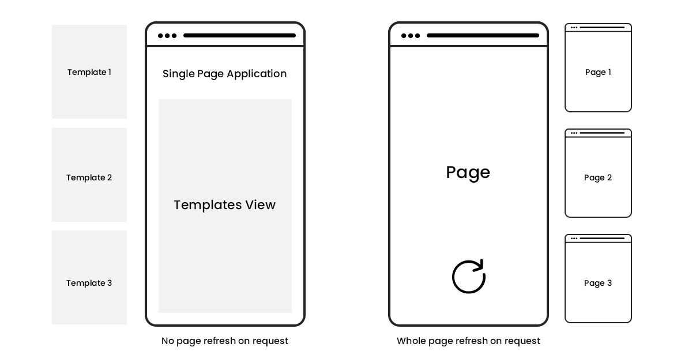

# Routing The React Router

Today, we'll talk about some of React's internals with Single Page Applications, and how using external libraries for page navigation like [React-Router](https://reactrouter.com/web/guides/quick-start) is different than normal page navigation!

# Table of Contents

- [Single Page Applications](#single-page-applications)
- [Plain HTML Websites](#plain-html-websites)
    - [Key Features of HTML Page Navigation](#key-features-of-html-page-navigation)
- [React Single Page Applications](#react-single-page-applications)
- [Webpack and Common Pitfalls](#webpack-and-common-pitfalls)
    - [Styled Components](#styled-components)
- [Emulating Multiple Pages In React](#emulating-multiple-pages-in-react)
- [React Router DOM](#react-router-dom)
    - [Routers](#routers)
        - [Links](#links)
        - [Switches](#switches)
    - [Passing Data Through URLs](#passing-data-through-urls)
        - [useParams Hook](#useparams-hook)
        - [Render Prop](#render-prop)
    - [Nested URL Parameters](#nested-url-parameters)
- [Conclusion](#conclusion)

## Single Page Applications

Before we take a look at routing within React Applications, we should take a look how we would traverse across different pages in plain html/css websites vs React websites, and the differences between them!

### Plain HTML Websites

Looking at our [Day of Code](https://day-of-code-2021.netlify.app) for example, we can see how navigating between different html files works.

### Key Features of HTML Page Navigation

- Using links with the a tag, we can traverse to different pages of our application.
- Each separate file is its own webpage with distinct html and css files. 
- We can use the same names for our css classes across different files.

### React Single Page Applications

However, with React applications, the way that navigation is set-up is slightly different!

Let's take a look at how a React web-site is set-up in the html and js file:

Within our index.html file...
```html
  <body>
    <div id = "root"></div>
  </body>
```

And in our index.js file...

```tsx
ReactDOM.render(
    <React.StrictMode>
      <App />
    </React.StrictMode>,
    document.getElementById('root')
);
```

Even if we have a React Application with multiple pages, it's all self contained within a **single page**, and all our code gets combined into one giant webpage. This type of website is called a **Single Page Application**, and the main difference between this versus a Multi Page Application is that instead of fetching new pages whenever the user requests to move from one page to another, everything is contained within a **single** page. When requesting to view "another page", we simply load up one of the templates that the page can display instead!



React uses [webpack](https://webpack.js.org), a static module bundler for JavaScript applications which combines all of our css,js, tsx, and asset files all for our SPA. (Fun fact, all the webpack configuration gets set-up when we run `yarn create-react-app` for us!) It adds all of our styles into the header of a **single file** for production, but that might lead to some issues...

### Webpack and Common Pitfalls

Since webpack combines all of our CSS styles into the header of our singular `index.html` file, there's a few things that we can't do in React that we can do in Multi Page Applications.

If you have multiple css files that contain the same class names, but are imported by different React pages/components, one will override the other and they will not retain their individual styles due to the webpack configuration for building our SPA.

**Example**: Let's say that we have two different pages that we want to represent, `FirstPage` and `SecondPage`. Each has their own css file, and if we define a shared class, `the-dress` separately between each css file, only one of them will actually be shown within our app and they will look the same!

**firstPage.css**

```css
.the-dress {
    /* our styling here */
    background-color: white;
    color: gold;
}
```

**secondPage.css**

```css
.the-dress {
    /* different styling for same class name! */
    background-color: blue;
    color: black'
}
```

And when we try using them within our application, even though we import separate css files, only one of the `the-dress` styles will show up between the two!

**firstPage.tsx**

```tsx
import React from "react";
import "./firstPage.css";

export default function FirstPage(): JSX.Element {
    return(
        <div className = "the-dress">
            This is my first page!
        </div>
    );
}
```

**secondPage.tsx**

```tsx
import React from "react";
import "./secondPage.css";

export default function SecondPage(): JSX.Element {
    return(
        <div className = "the-dress">
            This is my second page!
        </div>
    );
}
```

### [Styled Components](https://styled-components.com)

Styled components offer a way to mitigate this by using **CSS-in-JS**, or you can also use [css-modules](https://github.com/css-modules/css-modules) to include multiple versions of the same className. I won't go in detail on them but you can read about them here!


### Emulating Multiple Pages In React

Even though React Apps are single page applications, we can emulate the usage of multiple pages through routing libraries like [`react-router-dom`](https://reactrouter.com/web/guides/quick-start) or [`reach-router`](https://reach.tech/router/). These two routing libraries are the most popular routing libraries for React applications. (In fact, they're actually combining together in the **very** near future and the merger has been in progress for the past two years!) Eventually, the best parts of each library will give us developers the best experience, but for today we will focus on the `react-router-dom` library!


## [React Router DOM](https://reactrouter.com/web/guides/quick-start)

React Router is a third-party router library that emulates multiple pages within a Single Page Application. First, let's go over how we can use it to change our URL and use it to showcase different things on the page!

### Routers

React Router offers a variety of Router types for us to use, but today we'll focus on the [`BrowserRouter`](https://reactrouter.com/web/api/BrowserRouter) that uses HTML5 history API to emulate page navigation just like in normal web applications, visiting previous "pages" with the forward/backward buttons in our browser! To use it, you can simply wrap your app with the `Router` of your choice.

```tsx
import React from "react";
import { BrowserRouter as Router, Switch, Route, Link } from "react-router-dom";

export default function App() : JSX.Element {
    return (
        <Router>
            <AppBody/>
        </Router>
    );
}
```

The main way that we can navigate through pages is with Links and Switches!

### [Links](https://reactrouter.com/web/api/Link)

Just like how we can use `a` tags with `href` to navigate across different pages within regular web applications, we can use the `Link` feature within React Router to change the contents of our URL!

Under the hood, the Link tag works like the a tag, but simplifies the process a lot for us developers. To use it, we simply wrap the JSX component that we want to use to navigate across different URLs with the `Link` tag to change what shows up in our URL!

**CAUTION:** You can only use the link tag if somewhere higher up in the component tree (either the current component or one of its parent components) is wrapped within the `Router` tag.

Within our AppBody from up above... we can make a navbar that goes to different pages!

```tsx
<nav className="navbar">
    <div>
        <Link to="/">
            <button className="button-container">Base Page</button>
        </Link>
        <Link to="/first">
            <button className="button-container">First Page</button>
        </Link>

        <Link to="/second">
            <button className="button-container">Second Page</button>
        </Link>

        <Link to="/third">
            <button className="button-container">Third Page</button>
        </Link>
    </div>
</nav>
```

### [Switches](https://reactrouter.com/web/api/Switch)

Now that we've taken a look at how to change the content of our URL, how can we conditionally show different things on the screen depending on the URL? To do that, we use Switches and Routes to conditionally show things on the screen. Just like a switch statement, you only display the contents of **one** of the routes, depending on the current URL!

Further down in our appBody...

```tsx
<Switch>
    <Route exact path="/">
        Click a page on the top to get started!
    </Route>
    <Route path="/first">
        <div className="subcomponent-container">
        <FirstPage />
        </div>
    </Route>
    <Route path="/second">
        <div className="subcomponent-container">
        <SecondPage />
        </div>
    </Route>
    <Route path="/third">
        <div className="subcomponent-container">
        <ThirdPage />
        </div>
    </Route>
</Switch>
```

**CAUTION**: Within a Switch statement, it will automatically choose the first path that contains the path specified. If we removed the `exact` prop for our first Route, then none of the other routes would be displayed! To alleviate this, we can either move our landing page denoted by `"/"` to the bottom of the switch, or pass the `exact` prop to our landing page route. 

### Passing Data Through URLs

The URL can be used for more than simply rendering different things on the page. Let's say we want to pass in some data from the URL into the webpage itself (this can be useful for user authentication, chatroom messages, and anything else we might want to store in the URL!). Within our Switch elements, we can use the **":"** identifier in our path to identify a variable that we will use within our children components of the switch!

**Example:** Here, we're going to display what's next in the url after the `/` and store it in a component!


If we take a look at how this is represented in the code, we can see how we pass in the parameter variable and give it the name `currentsection` inside our path.

```tsx
<Switch>
    <Route path = "/:currentSection">
        <Identifier/>
    </Route>
<Switch>
```

Then once we're inside the `Identifier` component that uses the data stored inside the URL, we can grab that data using either the custom 
`useParams()` hook or the render prop that comes with React-Router. This offers us a way to pass down data across pages without even using React props! (We'll cover custom hooks later!)


### useParams Hook

Here's how we could use our useParams hook within our component:

```tsx
import { useParams } from "react-router-dom";

export default function Identifier(){
    let { currentSection } = useParams();
    return (
        <div className = "odd-component">
            The URL currently contains {currentSection}
        </div>
    );
}
```

**CAUTION:** when you pass down parameters this way, you will not get any "matches" for your Switch Routes if the URL is the empty base URL of **/**, since the route expects something after the **/** but nothing is there. To circumvent this, we can add in a special Route with the `path = "*"` property that acts as a 404 error handler if there are no routes matched.

A look at how it is in action!


### Render Prop

If you want the parent to handle the parameter logic and turn its child component to a **pure component** (one that doesn't depend on state logic/hooks, just props as data), you can use the render prop to handle it!

We'd change our route from

```tsx
<Switch>
    <Route path = "/:currentSection">
        <Identifier/>
    </Route>
<Switch>
```

to 

```tsx
import { RouteComponentProps} from "react-router-dom";

<Switch>
    <Route 
        path = "/:currentSection"
        render = {props : RouteComponentProps =>
       (
           //We have to get the matched path's parameters!
           <Identifier 
                currentSection = {props.input.match.params.currentSection}
            />
       ) 
        }
    />
<Switch>
```

And we'd have to change our `Identifier` to: 

```tsx

interface IdentifierProps {
    currentSection : string;
}

import { useParams } from "react-router-dom";

export default function Identifier(props : IdentifierProps){
    //Using props, Identifier is a pure component with no side-effects!
    return (
        <div className = "odd-component">
            The URL currently contains {props.currentSection}
        </div>
    );
}
```

### Nested URL Parameters

With our usage of parameter variables, we aren't limited to just one variable at a time. By separating different variables with the **":/"** separator we can pass in multiple parameter variables at once.

**Example:** Let's try taking a look at a page that takes in a random number 0-10 and a random number 11-20 whenever we move to that page.

With some string interpolation, we can pass the numbers into our URL within our `Link` tag.

```tsx
<Link to={`/random/${chooseNum10()}/${chooseNum20()}`}>
    <button className="button-container">Random Num</button>
</Link>
```

Our URL will be in the pattern of `/random/7/18`

When we parse the data of our URL within the `Route` of our `Switch`, we can do the same thing we did above of using the **":/"** separator to read in multiple variables, and name them whatever we want to.

```tsx
{/* First and second are URL parameter variables we are reading in!*/}
<Route path="/random/:first/:second">
    <div className="subcomponent-container">
        <RandomNum />
    </div>
</Route>
```

When using multiple parameters with our `useParams()` hook, we can grab it the same way as with one parameter, and selectively use parameters from our url (or pass down props through render prop instead).

```tsx
export default function RandomNum(): JSX.Element {
    const {first, second} = useParams();
    return (
        <div className = "odd-component">
            This is the Random Nums Page!
            <div> The first number passed in is {first} </div>
            <div>The second number passed in is {second} </div>
        </div>
    );
}
```

As you can see here, we can change the number in the URL and pass it down **without** props!


## Conclusion

We've simply scratched the surface of everything that React-Router uses! Query parameters, history, recursive paths, and a ton more. So far, we've covered showing different components based off of parameters and passing information to children component through url parameters. Everything you need is in the [React Router documentation](https://reactrouter.com/web/guides/quick-start) and some things might be changing in the very near future when React and Reach router merge together :eyes:.
