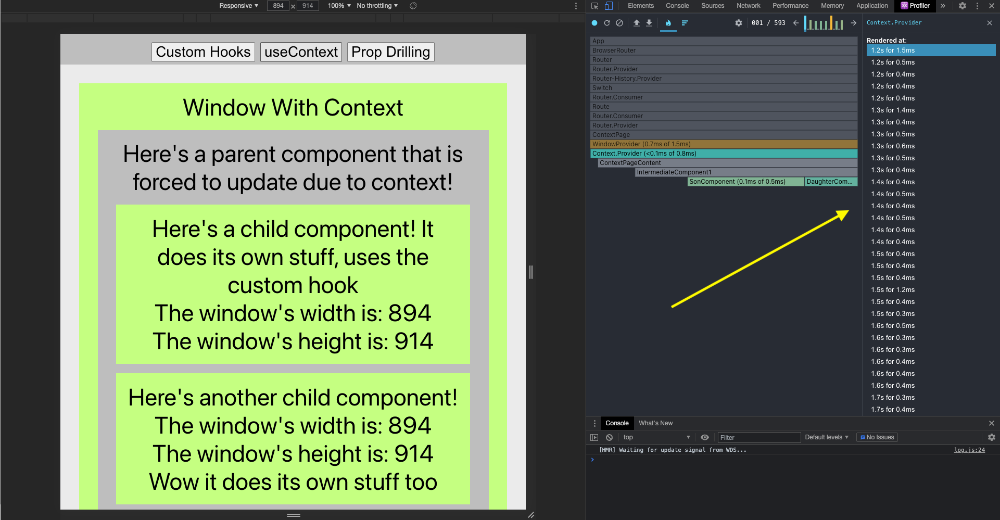

# Accustomed To Custom Hooks

So far, we've been discussing how a lot of the tools/practices that we use/follow when making React apps can help organize code and make it more readable:

- Compartmentalization of state logic
- Hooks like `useReducer` and `useContext`
- Functional Programming Paradigm
- Higher Order Components
- Separation of Concerns

This week, we'll talk about how custom hooks embody all of these concepts and **why/how** we would use custom hooks to clean up our code!

## Table of Contents

- [Hooked Components Handling State Logic](#hooked-components-handling-state-logic)
- [Discrete Logic](#discrete-logic)
- [Custom Hooks](#custom-hooks)
  - [Why Use Custom Hooks?](#why-use-custom-hooks)
  - [Custom Hooks Vs React Context](#custom-hooks-vs-react-context)
- [Custom Hooks Can Improve React App Performance](#custom-hooks-can-improve-react-app-performance)
  - [Custom Hook Performance](#custom-hook-performance)
  - [Context Performance](#context-performance)
  - [Prop Drilling Performance](#prop-drilling-performance)
- [Example useWindowDimensions Custom Hook](#example-usewindowdimensions-custom-hook)
- [How Do Custom Hooks Solve Common Problems?](#how-do-custom-hooks-solve-common-problems)
- [How Do Custom Hooks Work?](#how-do-custom-hooks-work)
  - [Functional Composition](#functional-composition)
- [Making Custom Hooks](#making-custom-hooks)
  - [Creating Our Custom Hook Functions](#creating-our-custom-hook-functions)
- [Using Custom Hooks](#using-custom-hooks)
- [Custom Hooks Use Case](#custom-hooks-use-case)
- [Conclusion](#conclusion)

## Hooked Components Handling State Logic

**"With hooks we separate code not based on the lifecycle method name, but based on what the code is doing"**.

One of the great things with React hooked components is that we don't need to keep track of one giant `this.state` but can instead keep track of each state variable discretely and independently of each other, utilizing discrete logic.

## Discrete Logic

With discrete logic, we can take advantage of "separation of concerns." Through separation of concerns, we're able to separate our logic in multiple ways:

- Splitting components into ones that only handle state logic and ones that only handle displaying content onto the screen

- Separating each aspect of the component lifecycle into what we want to do instead of when we want to do it.

Hooked Way:

```tsx
function MyComponent() {
  //state variables
  const [stateStr, setStateStr] = useState("");
  const [stateNum, setStateNum] = useState(0);
  const [stateBool, setStateBool] = useState(false);

  //effects that listen to changes
  useEffect(() => {
    console.log("stateStr changed!");
  }, [stateStr]);

  useEffect(() => {
    console.log("stateNum changed!");
  }, [stateNum]);

  useEffect(() => {
    console.log("stateBool changed!");
  }, [stateBool]);

  return <div></div>;
}
```

Class-Based Component Way:

```tsx
class ClassBased extends React.Component {
  constructor(props) {
    super(props);
    this.state = {
      stateStr: "",
      stateNum: 0,
      stateBool: false,
    };
  }

  componentDidUpdate(prevState) {
    if (this.state.stateStr !== prevState.stateStr) {
      console.log("stateStr changed!");
    }

    if (this.state.stateNum !== prevState.stateNum) {
      console.log("stateNum changed!");
    }

    if (this.state.stateBool !== prevState.stateBool) {
      console.log("stateBool changed!");
    }
  }

  render() {
    return <div></div>;
  }
}
```

Which one looks more organized to you?

## Custom Hooks

Custom hooks take this same concept of **discrete logic** and let us **combine logic that is distinct from other parts of the application and self-contains it to its own individual function.**

### Why Use Custom Hooks?

Custom hooks are useful for repeated, compartmentalizable logic that is used multiple times throughout an application, or when you want to separate your logic across different functions.

### Custom Hooks Vs React Context

The use cases for custom hooks is similar to the `useContext` hook that already exists, so let's take a look at an example that can be used either way and compare the pros/cons between them!

## Example useWindowDimensions Custom Hook

For our example, we're going to want to get the window dimensions of the browser, and update in real-time to state changes throughout multiple components of the app.


Besides from using custom hooks, how can we implement this functionality?


## Custom Hooks Can Improve React App Performance

By using the [React Developer Tools Chrome Extension](https://chrome.google.com/webstore/detail/react-developer-tools/fmkadmapgofadopljbjfkapdkoienihi/related?hl=en) we can "profile" our React apps for performance and see how many times our components have to re-render!

Let's take a look and compare the performance of each of the three approaches: custom hooks, context, and prop drilling, and compare how many times the "parent component" is forced to re-render even if it doesn't care about logic that only its children component use.

### Custom Hook Performance


### Context Performance



### Prop-Drilling Performance


# How Do Custom Hooks Solve Common Problems?

Performance problems of wrapping entire component trees with React Contextare solved because you only need to call the custom hook inside the components that depend on its logic.

With prop-drilling, we reduce code overuse and prop-overforwarding because we only have to write the code that handles all the logic **a single time.**

## How Do Custom Hooks Work?

At their core, custom hooks work just like functional composition within the functional programming paradigm.


### Functional Composition

As a review of functional composition, let's take a look at some example functions!

```tsx
function motherFunction() {
  console.log("This is a parent function that does its own stuff!");
  console.log("It also calls its child function!");
  childFunction();
  console.log("It does its own stuff afterwards too.");
}

function fatherFunction() {
  console.log("This parent function also does its own stuff!");
  console.log("It calls the child function too.");
  childFunction();
  console.log("It does its own stuff afterwards too.");
}

function childFunction() {
  console.log("This is our child function!");
}
```

In this example of functional composition, you can simply call a child function from different parent functions if two parent functions have shared logic between them, helping to prevent code reuse.

Custom hooks do the exact same thing! If two components share logic that can be encapsulated into a separate component, you can create a **custom hook** that can be called multiple times within different React components.


To determine if logic can be encapsulated into a separate component, take a look at what other logic it depends on. Looking at this digraph for instance, since 1,2,3 depend on each other, that logic can be encapsulated and likewise for 4,5.

## Making Custom Hooks

When making custom hooks, all the [same rules](https://reactjs.org/docs/hooks-rules.html) apply to regular React hooks.

- Only Call Hooks from React functional components or custom Hooks.
- Only call them on the top level of your components (NOT within subfunctions, for loops, if statements, etc)

Similarly to useReducer, custom hooks have set-up both outside the component you want to use it in and within the component itself.

### Creating Our Custom Hook Functions

When making a custom hook, it is convention and best practice to start its name with `use` so that we know that the [rules of hooks](https://reactjs.org/docs/hooks-rules.html) apply to it.

```tsx
export function useWindowDimensions() {
  //you can use state variables inside of custom hooks
  const [windowWidth, setWindowWidth] = useState(getWindowWidth());
  const [windowHeight, setWindowHeight] = useState(getWindowHeight());

  //object destructuring functions to get the widths/height from window
  function getWindowWidth(): number {
    const { innerWidth: width } = window;
    return width;
  }

  function getWindowHeight(): number {
    const { innerHeight: height } = window;
    return height;
  }
}
```

Within our custom hooks, we can use the `useState` hook just like in a React component! We can use hooks, (custom / regular) **only** inside of React components and custom hooks.

We can also use the `useEffect` hook as well to set up event listeners.

```tsx
//you can use all react hooks inside of your own custom hooks!

//setup event listener to update dimensions when they change
useEffect(() => {
  function handleResize() {
    setWindowWidth(getWindowWidth());
    setWindowHeight(getWindowHeight());
  }
  window.addEventListener("resize", handleResize);
  //unsubscribe from window changes on unmount
  return () => {
    window.removeEventListener("resize", handleResize);
  };
}, []);
```

And inside the return value of your custom hook, you can return a value that you use just like with the other hooks we've used!

The return value of our custom hook:

```tsx
type WindowAttributes: number[];

export function useWindowDimensions() : WindowAttributes {
    //...the rest of our custom hook

    export [windowWidth, windowHeight];
}
```

## Using Custom Hooks

Just like with child function within function composition, we can call our custom hook from the component that depends on it, and all the logic of how it works (the state variables we use to keep track, the useEffect which sets up the event-listener, etc. ) is hidden inside the custom hook!

For the developer using the custom hook within a component, it's like using an API call.

```tsx
function SonComponent() {
  const [windowWidth, windowHeight] = useWindowDimensions();
  return (
    <div className="odd-component">
      <div>
        Here's a child component! It does its own stuff, uses the custom hook.
      </div>
      <div>The window's width is: {windowWidth}</div>
      <div>The window's height is: {windowHeight}</div>
    </div>
  );
}
```

As you can see, we don't need to use state **at all** within our component itself, but it updates as our window changes since all the state/effect logic is encapsulated within our custom hook.

## Custom Hooks Use Case

Custom hooks are another tool that we can add to our toolkit of ways to organize React code and write better, cleaner, and more efficient code!

The website [useHooks.com](https://usehooks.com) has a lot of great examples of custom hooks that you can implement in your applications!

# Conclusion

In conclusion, custom hooks take advantage of all the concepts we've discussed so far:

- Compartmentalization of state logic with hooks as opposed to class-based components
- Function composition of the functional programming paradigm
- Separation of Concerns with Higher Order Components
- Centralization of State Logic

Hooks are useful for repeated, compartmentalizable logic that is used multiple times throughout an application, or when you want to separate your logic into different functions. They are a really powerful tool that help to clean up, organize, and optimize our code!
